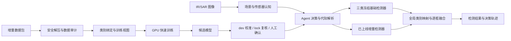

# 灵动Agent

面向 IR/SAR 时变场景目标检测的快速学习智能体。系统以场景与传感器认知为上下文，自动协调冻结基础检测器和增量检测器，并提供增量数据审计、快速训练、模型复核、代际切换与回滚能力。

项目同时提供面向检测用户的 Web 工作台和面向开发、运维及未来端侧集成的 CLI。当前发布版运行于 x86-64 WSL/Linux 与 NVIDIA GPU；Ascend 310B 适配将在硬件到位后完成。

## 核心能力

- **自动识别与路由**：识别 IR/SAR 传感器和 air/forest/sea/urban 场景，自动解析当前生产代际并执行对应模型。
- **增量目标检测**：支持类别增量和目标增量；训练、验证、早停和调参只读取本批增量数据。
- **双前端操作**：Web 提供单图、批量检测和增量数据工作台；CLI 提供完整决策轨迹、配置、实验、日志及代际管理。
- **可审计与可回滚**：数据、配置、权重、阈值和评测结果均记录哈希；候选模型通过门禁后才能切换 production。
- **配置驱动**：GPU、推理、路由、融合、上传、缓存、训练及验收参数统一由 YAML 管理，并支持 CLI 临时覆盖或持久修改。

## 系统架构



当前 production 为“增量检测生产代际”：基础检测器负责 `soldier`、`small_aircraft` 和 `tank`，增量检测器当前验证绑定为 `warship`。四类统一 YOLO11s 仅作为性能上限基准，不参与默认推理和回滚。

## 当前状态

| 能力 | 状态 | 说明 |
| --- | --- | --- |
| x86 NVIDIA GPU 推理 | 可用 | 默认 PyTorch CUDA 加载模型权重，不提供 CPU 回退 |
| Web / CLI | 可用 | 支持检测、决策展示、增量数据管理和结构化日志 |
| 舰船 3+1 类别增量 | 已验证 | 单轮内部 lock-val 证据已通过门禁 |
| 多轮增量 | 工程接口已预留 | 当前训练适配器只完成单轮实证 |
| Ascend 310B | 待硬件验证 | 尚无 OM、AscendCL 和真实板端 FPS |
| 官方隐藏测试提交 | 待赛题信息 | 测试目录和提交格式确认前保持阻塞 |

## 快速开始

### 运行环境

- x86-64 WSL 2 或 Linux
- NVIDIA GPU 及可用的 `nvidia-smi`
- Python `3.10-3.12`
- 建议至少 `10 GB` 可用空间

仓库只发布可移植的模型权重，不分发与 GPU 架构、TensorRT 版本绑定的 `.engine` 文件。默认配置直接使用 CUDA 版 PyTorch 和 Ultralytics 加载 `.pt` 权重；需要 TensorRT 加速时，在目标设备本地导出并保存在 `runs/engines/`。

版本库只同步源代码、公共配置、文档、训练权重，以及复核模型身份和指标所必需的校准、指标与 manifest。以下可重建产物始终留在本地：数据视图、运行报告、预测结果、设备专用配置、TensorRT/ONNX/OM 文件、原生构建目录和运行缓存。

### 可选 TensorRT 加速

默认 CUDA 后端无需模型转换即可运行。需要 TensorRT 加速时，在部署设备完成以下操作：

```bash
AGENT_PYTHON=/path/to/env/bin/python
"$AGENT_PYTHON" -m pip install -e ".[workbench,inference,tensorrt,export]"

PROFILE="configs/agent_pipeline.local.yaml"
cp configs/agent_pipeline.yaml "$PROFILE"
```

在 `$PROFILE` 中填写 GPU 编号、TensorRT 版本和计算能力，导出阶段保持 `inference.backend: ultralytics_cuda`，然后运行：

```bash
./scripts/export_tensorrt_engines.sh "$PROFILE"
"$AGENT_PYTHON" -m fair_agent.cli --config "$PROFILE" tensorrt validate --activate
```

脚本会完成环境核对、模型导出、SHA256 登记和完整性校验；第二条命令会完成 CUDA/TensorRT 精度对齐与 API 性能门禁，全部通过后才原子启用。生成文件保存在 `runs/engines/`，不会进入版本控制。完整说明见 [TensorRT 部署指南](docs/tensorrt-deployment.md)。

需要 INT8 PTQ 时，在设备配置中设置 `tensorrt_backend.precision: int8`，然后使用一条命令完成代表样本选择、校准、导出和门禁：

```bash
"$AGENT_PYTHON" -m fair_agent.cli --config "$PROFILE" tensorrt calibrate --activate
```

Agent 会保证基础模型与增量专家使用各自合规的数据来源；后续新专家仅使用本轮增量 train/dev 自动校准，封存 lock 不参与量化。当前推荐的检测器混合精度策略固定为模块 `0-1` 使用 INT8、模块 `2-23` 使用 FP16，对应 YAML 中的 `mixed_precision.fp16_layer_patterns`；设备本地仍需重新导出并验收 engine。

### 首次配置

```bash
git clone https://github.com/Sakauma/AgileAgent.git
cd AgileAgent
chmod +x scripts/bootstrap_x86.sh scripts/start_agent.sh
./scripts/bootstrap_x86.sh
```

配置脚本会选择或创建兼容的 Python 环境，检查 CUDA、PyTorch 和项目依赖，随后执行发布校验与 GPU 冒烟测试。兼容环境已存在时可显式复用：

```bash
AGILE_AGENT_PYTHON=/path/to/env/bin/python ./scripts/bootstrap_x86.sh
```

兼容的第三方依赖会直接复用，不会重复安装。配置脚本还会单独确认 `agile-agent` 命令入口属于当前检出的仓库；仅当入口缺失或指向其他目录时，才以 `--no-deps` 方式重新注册当前项目。

已验证的参考组合为 Python `3.10.19`、PyTorch `2.5.1+cu124`、TorchVision `0.20.1+cu124` 和 Ultralytics `8.4.92`。项目允许使用满足约束且通过 `doctor` 的兼容版本，不要求环境名称或安装路径一致。TensorRT 仅在设备本地导出时安装。

### 一键启动

```bash
./scripts/start_agent.sh
```

浏览器访问 `http://127.0.0.1:8501`。日常启动脚本只执行环境门禁、刷新状态和启动服务，不安装或修改依赖。

无浏览器环境使用 CLI 工作台：

```bash
./scripts/start_agent.sh --cli
```

## 竞赛数据与固定划分

默认 Web/CLI 检测使用仓库内发布权重，不要求下载竞赛训练集。API 性能验收、舰船 3+1 复现实验和指标复核需要原始竞赛训练数据。由于数据授权限制，仓库只发布固定划分清单，不发布图像和标签。

将数据放置为以下结构：

```text
datasets_r1_base_train/
├── classes.txt
├── ir_r1_base_air_000001.png
├── ir_r1_base_air_000001.txt
└── ...
```

`classes.txt` 按行写入：

```text
soldier
small_aircraft
warship
tank
```

仓库中的 [`splits/`](splits/README.md) 已包含固定的 `560/95/95` train、dev 和 lock 清单，以及对应的 IR/SAR 子集。数据就位后执行：

```bash
python tools/00_check_dataset.py
python tools/01_build_metadata.py
agile-agent experiment validate --config configs/incremental/warship_3plus1.yaml
```

三项均通过后，才运行依赖真实数据的命令：

```bash
agile-agent benchmark-api
agile-agent experiment run --config configs/incremental/warship_3plus1.yaml
```

`benchmark-api` 使用 `splits/lock_val.txt` 中的 95 张图像；缺少原始数据时不能用合成图替代正式性能验收。

## 使用方式

### Web 工作台

Web 面向评委和检测用户，提供：

- 单图检测、自动场景理解和 Agent 决策摘要
- 批量检测、逐图预览和结果包导出
- 增量数据上传、样本浏览、类别补名、数据注入和后台训练
- 当前会话历史结果跳转

用户无需选择模型。Agent 会读取活动代际，执行类别所有者并完成全局 ID 映射和 class-aware NMS。未通过验收的候选模型不会进入默认检测链路。

### CLI

首次配置后，可激活记录在 `.agent-python` 中的环境：

```bash
AGENT_PYTHON="$(cat .agent-python)"
source "$(dirname "$AGENT_PYTHON")/activate"
```

常用命令：

```bash
agile-agent doctor
agile-agent status --format json --refresh
agile-agent console
agile-agent detect --source path/to/image.png --confidence 0.50
agile-agent decide --source path/to/image.png
agile-agent logs --limit 100
```

`detect` 输出完整上下文、候选协议、模型执行、跳过原因和融合记录，适合调试或接入其他程序。Web 仅显示经过简化的用户决策摘要。

## 增量学习工作台

上传包为 ZIP，采用 YOLO 图像和标签结构：

```text
new_batch.zip
├── data.yaml                 # 可选，建议提供 names
├── images/train/*
├── images/val/*              # 可选，缺失时确定性划分
├── labels/train/*
└── labels/val/*
```

赛题增量数据与基础训练集采用相同的五列 YOLO 标签：`class x_center y_center width height`，Agent 会直接读取类别 ID。为兼容异常或临时数据，四列无类别标签不会被直接拒绝，而会按单一待确认类别导入，并在批次后台和结构化日志中显示警告。数据集未提供类别名称时，Agent 会分配稳定全局 ID 和“类别N”临时名称；用户可在 Web 或 CLI 中补充真实名称，重命名不会改变标签映射、训练快照或已有权重。

工作台依次完成：

```text
上传 → 数据血缘审计 → 自动封存lock → GPU训练 → dev逐类校准 → 可选INT8 PTQ → lock复核 → shadow加载 → 受控上线
```

生产配置会在缺少显式 lock 时按固定种子和类别组合自动封存20%样本；封存内容不进入训练 YAML。训练完成后，Agent 自动完成逐类阈值校准、动态代际注册、独立 lock 复核和 shadow 预热。数据隔离与资产哈希必须有效，赛题基础 mAP50、New-mAP50、KRR、组合 mAP50 和 FPS 达标后才会原子切换 production；precision、误激活和时延分位数作为风险诊断展示，不参与硬性否决。

同一批次包含多个新增类别时只训练一个多类增量检测器，并为每个全局类别保存独立阈值。推荐的统一 CLI 入口：

```bash
agile-agent incremental audit --batch /path/to/new_batch.zip
agile-agent incremental run --batch BATCH_ID
agile-agent incremental status --run-id TRAIN_JOB_ID
```

`incremental run` 是前台完整生命周期命令，会持续运行到上线、拒绝或回滚并返回相应退出码；Web 工作台使用同一状态机，但任务在后台执行。

底层分步命令仍可用于排障：

```bash
agile-agent incremental-data upload --archive /path/to/new_batch.zip --name 新批次
agile-agent incremental-data list
agile-agent incremental-data show --batch-id BATCH_ID
agile-agent incremental-data rename --batch-id BATCH_ID --class-names 新类别名称
agile-agent incremental-data inject --batch-id BATCH_ID
agile-agent incremental-data train --batch-id BATCH_ID
agile-agent incremental-data jobs --batch-id BATCH_ID
```

完整数据约定和状态流转见 [增量学习工作台](docs/incremental-workbench.md)。

## 模型与指标

| 模型 | 功能 | 内部 lock-val 结果 | 状态 |
| --- | --- | --- | --- |
| Scene-SensorNet | IR/SAR 与四场景认知 | sensor 0.98947 / scene 0.76842 | production 上下文模型 |
| 三类基础检测器 | 冻结旧类检测 | 旧类 mAP50 0.82738 | production 旧类所有者 |
| 增量检测器 | 新类别检测 | New-mAP50 0.79500 / KRR 1.000 | production，当前绑定舰船 |
| 四类统一 YOLO11s | 单模型上限参考 | mAP50 0.91202 | `benchmark_only` |

组合系统在 95 张内部 lock-val 上取得 mAP50 `0.81929`、舰船 precision `1.000`、recall `0.79012` 和误激活率 `0.000`。检测指标均指 mAP50；这些结果不是官方隐藏测试成绩。

x86 NVIDIA GPU 上的性能结果只用于工程验证，具体吞吐和单图延迟取决于设备、后端及运行状态，不能替代 Ascend 310B 实测。

## 配置管理

[`configs/agent_pipeline.yaml`](configs/agent_pipeline.yaml) 是运行参数的唯一持久事实源。CLI 的 `--set` 只覆盖当前进程；`config set` 会校验并原子写回 YAML：

```bash
agile-agent config validate --config configs/agent_pipeline.yaml
agile-agent config show --config configs/agent_pipeline.yaml --effective
agile-agent config get routing.conflict_iou
agile-agent config set routing.conflict_iou 0.50
agile-agent --set inference.confidence_default=0.60 serve
```

production 代际、类别所有权和权重身份属于受保护状态，只能通过 `generation recheck/promote/rollback` 修改。

## 可复现实验

舰船 3+1 实验通过单一 YAML 描述基础类别、增量类别、数据划分和验收门槛：

```bash
agile-agent experiment validate --config configs/incremental/warship_3plus1.yaml
agile-agent experiment run --config configs/incremental/warship_3plus1.yaml
agile-agent experiment reproduce --manifest runs/experiments/warship_3plus1/<run_id>/run_manifest.json
```

增量阶段禁止读取旧类原始图像、旧类标签和旧数据缓存特征。lock-val 只在权重与阈值冻结后解封。逐文件哈希、状态机和复现边界见 [舰船 3+1 可复现实验](docs/warship-3plus1-reproducibility.md)。

## 开发与验收

```bash
pytest -q
python scripts/verify_release.py
python scripts/smoke_models.py
```

- `pytest` 验证配置、路径门禁、路由融合、增量数据、日志和代际操作。
- `verify_release.py` 校验配置、模型权重和公开证据哈希。
- `smoke_models.py` 在 GPU 上加载三种功能模型并运行完整自动编排链路。

当前代码基线为 `159 passed`。修改模型、推理后端或依赖后，必须重新执行三项验收。

## 项目结构

```text
fair_agent/
├── backends/       # CUDA/TensorRT 推理后端
├── core/           # 配置、黑板、manifest 和审计日志
├── modules/        # 数据、推理、增量实验和代际管理
├── policies/       # 动作选择与路由策略
├── executors/      # 受控动作执行器
├── web/            # Starlette Web 服务与静态前端
└── ui/             # 终端工作台
configs/            # 运行和实验 YAML
models/             # 冻结权重、注册表和指标
scripts/            # 安装、启动和发布验收
tools/              # 数据处理、训练和导出入口
tests/              # 自动化测试
docs/               # 设计、操作和复现实验文档
```

竞赛图像、标签、运行报告、预测结果、设备部署产物、构建缓存和本地凭据均被 Git 忽略。固定数据划分清单由 Git 跟踪，用于在各设备上复现同一 train/dev/lock 边界。TensorRT 导出与校验代码保留在仓库中，生成的 engine 不进入版本控制。

## 文档

- [Agent 操作手册](docs/agent-operations.md)
- [三种功能模型与协同链路](docs/functional-models.md)
- [合规增量学习规则](docs/compliant-incremental-learning.md)
- [增量学习工作台](docs/incremental-workbench.md)
- [全流程审计日志](docs/agent-audit-logging.md)
- [TensorRT 部署指南](docs/tensorrt-deployment.md)
- [舰船 3+1 可复现实验](docs/warship-3plus1-reproducibility.md)
- [增量方法比较](docs/incremental-method-comparison.md)
- [YOLO-IOD 完整复现](docs/full-yolo-iod-reproduction.md)

## 已知限制

- 尚未完成 Ascend 310B 的 OM 转换、AscendCL 集成和真实板端 FPS 验证。
- 当前只有一轮舰船类别增量的完整指标证据；多轮、多类别状态机和自动回滚已实现，但仍需使用后续真实批次补充连续实证。
- Web 与 CLI 均会从训练继续执行到逐类校准、lock复核和受控上线；任一门禁失败时保持原production。
- TensorRT engine 不随仓库发布；启用该后端前必须在目标设备本地导出并重新完成精度与性能验收。
- 仓库不包含竞赛数据集、官方测试集或正式提交格式。
