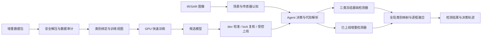

# 灵动Agent

面向 IR/SAR 时变场景目标检测的快速学习智能体。系统以场景与传感器认知为上下文，自动协调冻结基础检测器和增量检测器，并提供增量数据审计、快速训练、模型复核、代际切换与回滚能力。

项目同时提供面向检测用户的 Web 工作台和面向开发、运维及未来端侧集成的 CLI。当前发布版运行于 x86-64 WSL/Linux 与 NVIDIA GPU；Ascend 310B 适配将在硬件到位后完成。

## 核心能力

- **自动识别与路由**：识别 IR/SAR 传感器和 air/forest/sea/urban 场景，自动解析当前生产代际并执行对应模型。
- **增量目标检测**：支持类别增量和目标增量；训练、验证、早停和调参只读取本批增量数据。
- **双前端操作**：Web 提供单图、批量检测和增量数据工作台；CLI 提供完整决策轨迹、配置、实验、日志及代际管理。
- **可审计与可回滚**：离线增量训练记录数据隔离、配置、权重、阈值和评测证据；候选模型通过门禁后才能切换 production，失败时保留原代际。在线无标签检测不计算图像摘要，也不依据训练集或测试集身份路由。
- **配置驱动**：GPU、推理、路由、融合、上传、缓存、训练及验收参数统一由 YAML 管理，并支持 CLI 临时覆盖或持久修改。

## 系统架构



当前 production 仍为已验收的“双检测器增量代际”，不会被实验自动覆盖。严格时序3+1采用可迁移的并行 Agent：冻结三类基础检测器永久负责旧类别，增量专家从通用预训练表征初始化、只读取117/18张新增类 train/dev 并只负责新增类别；两个 owner 对每张图共同推理后做框级融合，不使用场景到目标类别的硬路由。候选只有在基础 mAP50、New-mAP50 和 KRR 三项赛题指标及数据完整性检查全部通过后才允许注册。

## 当前状态

| 能力 | 状态 | 说明 |
| --- | --- | --- |
| x86 NVIDIA GPU 推理 | 可用 | 默认 PyTorch CUDA 加载模型权重，不提供 CPU 回退 |
| Web / CLI | 可用 | 支持检测、决策展示、增量数据管理和结构化日志 |
| 舰船 3+1 类别增量 | 当前时序划分代理测试通过 | `strict-yolo11m-generic-20260806-215608` 已完整训练并通过三项计分门槛；尚不代表官方隐藏测试成绩 |
| 多轮增量 | 已完成机制验证 | 四批次连续回归和三组共 21 轮压力回归均通过当前硬门禁 |
| Ascend 310B | 待硬件验证 | 尚无 OM、AscendCL 和真实板端 FPS |
| 官方隐藏测试提交 | 待赛题信息 | 测试目录和提交格式确认前保持阻塞 |

当前唯一活动划分是时间隔离的固定 3+1 协议。`2026-08-06` 已按该划分完成一次严格训练和无标签预测冻结后的独立复核；更早的随机划分指标仍只作为历史参考，不能与当前成绩混用。

## 阅读导航

- [快速开始](#快速开始)：环境、首次配置、一键启动和可选 TensorRT 加速。
- [使用方式](#使用方式)：Web 与 CLI 检测入口。
- [增量学习工作台](#增量学习工作台)：上传、训练、校准、复核与上线流程。
- [配置管理](#配置管理)：YAML 参数和 CLI 覆盖。
- [可复现实验](#可复现实验)：舰船 3+1、多批次和压力回归。
- [开发与验收](#开发与验收)：测试、发布检查和 GPU 冒烟命令。

## 快速开始

### 运行环境

- x86-64 WSL 2 或 Linux
- NVIDIA GPU 及可用的 `nvidia-smi`
- Python `3.10-3.12`
- 建议至少 `10 GB` 可用空间

仓库只发布可移植的模型权重，不分发与 GPU 架构、TensorRT 版本绑定的 `.engine` 文件。默认配置直接使用 CUDA 版 PyTorch 和 Ultralytics 加载 `.pt` 权重；需要 TensorRT 加速时，在目标设备本地导出并保存在 `runs/engines/`。

版本库只同步源代码、公共配置、文档、训练权重，以及复核模型身份和指标所必需的校准、指标与 manifest。以下可重建产物始终留在本地：数据视图、运行报告、预测结果、设备专用配置、TensorRT/ONNX/OM 文件、原生构建目录和运行缓存。

### 可选 TensorRT 加速

默认 CUDA 后端无需模型转换即可运行。需要 TensorRT 加速时，在部署设备完成以下操作：

```bash
AGENT_PYTHON=/path/to/env/bin/python
"$AGENT_PYTHON" -m pip install -e ".[workbench,inference,tensorrt,export]"

PROFILE="configs/agent_pipeline.local.yaml"
cp configs/agent_pipeline.yaml "$PROFILE"
```

在 `$PROFILE` 中填写 GPU 编号、TensorRT 版本和计算能力，导出阶段保持 `inference.backend: ultralytics_cuda`，然后运行：

```bash
./scripts/export_tensorrt_engines.sh "$PROFILE"
"$AGENT_PYTHON" -m fair_agent.cli --config "$PROFILE" tensorrt validate --activate
```

脚本会完成环境核对、模型导出、SHA256 登记和完整性校验；第二条命令会完成 CUDA/TensorRT 精度对齐与 API 性能门禁，全部通过后才原子启用。生成文件保存在 `runs/engines/`，不会进入版本控制。

需要 INT8 PTQ 时，在设备配置中设置 `tensorrt_backend.precision: int8`，然后使用一条命令完成代表样本选择、校准、导出和门禁：

```bash
"$AGENT_PYTHON" -m fair_agent.cli --config "$PROFILE" tensorrt calibrate --activate
```

Agent 会保证基础模型与增量专家使用各自合规的数据来源；后续新专家仅使用本轮增量 train/dev 自动校准，封存 lock 不参与量化。本机实验验证过的可选混合精度策略为模块 `0-1` 使用 INT8、模块 `2-23` 使用 FP16，对应 YAML 中的 `mixed_precision.fp16_layer_patterns`；公开默认后端仍为 CUDA，每台设备都需在本地重新导出并验收 engine。

### 首次配置

```bash
git clone https://github.com/Sakauma/AgileAgent.git
cd AgileAgent
chmod +x scripts/bootstrap_x86.sh scripts/start_agent.sh
./scripts/bootstrap_x86.sh
```

配置脚本会选择或创建兼容的 Python 环境，检查 CUDA、PyTorch 和项目依赖，随后执行发布校验与 GPU 冒烟测试。兼容环境已存在时可显式复用：

```bash
AGILE_AGENT_PYTHON=/path/to/env/bin/python ./scripts/bootstrap_x86.sh
```

兼容的第三方依赖会直接复用，不会重复安装。配置脚本还会单独确认 `agile-agent` 命令入口属于当前检出的仓库；仅当入口缺失或指向其他目录时，才以 `--no-deps` 方式重新注册当前项目。

已验证的参考组合为 Python `3.10.19`、PyTorch `2.5.1+cu124`、TorchVision `0.20.1+cu124` 和 Ultralytics `8.4.92`。项目允许使用满足约束且通过 `doctor` 的兼容版本，不要求环境名称或安装路径一致。TensorRT 仅在设备本地导出时安装。

### 一键启动

```bash
./scripts/start_agent.sh
```

浏览器访问 `http://127.0.0.1:8501`。日常启动脚本只执行环境门禁、刷新状态和启动服务，不安装或修改依赖。

无浏览器环境使用 CLI 工作台：

```bash
./scripts/start_agent.sh --cli
```

## 竞赛数据与固定划分

默认 Web/CLI 检测使用仓库内发布权重，不要求下载竞赛训练集。API 性能验收、舰船 3+1 复现实验和指标复核需要原始竞赛训练数据。由于数据授权限制，仓库只发布固定划分清单，不发布图像和标签。

将数据放置为以下结构：

```text
datasets_r1_base_train/
├── classes.txt
├── ir_r1_base_air_000001.png
├── ir_r1_base_air_000001.txt
└── ...
```

`classes.txt` 按行写入：

```text
soldier
small_aircraft
warship
tank
```

仓库中的 [`splits/`](splits/README.md) 是唯一活动划分，固定模拟 `warship` 为新增类别：基础训练/验证为 `405/70` 张且只含 `soldier`、`small_aircraft`、`tank`，增量训练/验证为 `117/18` 张且只含 `warship`，最终混合测试为 `89` 张（`70` 张旧类图 + `19` 张新类图）。场景识别另用 `522/88/89` 张已知场景清单。旧随机逐帧 `560/95/95` 划分保存在 [`archive/splits_legacy_random_560_95_95/`](archive/splits_legacy_random_560_95_95/README.md)，不再作为活动入口。

### 官方固定评分口径（不得改写）

本仓库将赛题中的检测 `mAP` 固定实现为 `mAP@0.5`（下文记作 `mAP50`），正式验收只看以下三项：

| 计分项 | 正确计算口径 | 满分门槛 |
|---|---|---:|
| 基础目标检测 | 增量前的冻结基础模型，在不含新增类别的基础测试集上按三种基础类别计算 `base_test_map50` | `>= 0.80` |
| 新类别识别 | 增量后系统先在完整“旧类+新类”混合测试集上推理，再只按新增类别计算 `new_map50`（New-mAP）；旧类图上的新增类误检同样计入 | `>= 0.60` |
| 旧类别知识保持 | 在同一完整混合测试集、同一批图像上计算 `KRR = old_map50_after / old_map50_before` | `>= 0.95` |

`0.80` 是赛题基础检测满分线，不是本工程的停止训练条件。为给时序漂移和官方后续数据留出余量，当前内部发布安全线固定为 `base_test_map50 >= 0.85`；只有权重与 Agent 规则冻结后的独立基础测试结果才能证明该安全线，`base_dev`、训练集重采样验证和 OOF 交叉验证结果均不得冒充基础测试成绩。

截至 `2026-08-07`，当前基础候选的证据边界如下。开发侧已经超过内部 0.85 安全线，但现有750张数据无法再提供一份新的独立测试来证明最终候选；因此工程状态必须写成“OOF 已达线、独立测试未证明”，不能简写成“测试已达0.85”。

| 证据 | 基础 mAP50 | 可用于什么 | 不可用于什么 |
|---|---:|---|---|
| 五折调参折（289张） | `0.86865` | 选择固定融合规则 | 官方/独立测试声明 |
| 未参与选择的后置折（186张） | `0.88620` | 检查所选规则的开发泛化 | 官方/独立测试声明 |
| 完整连续块 OOF（475张） | `0.87641` | 当前最强非测试开发证据 | 替代隐藏测试成绩 |
| 48张 checkpoint-val sanity | `0.94250` | 在完整160 epoch预算内选择 `best.pt`、检查 refit 一致性 | 性能证据；该集合参与过 checkpoint 选择 |
| 首次解封时的70张旧类代理测试 | `0.80147` | 保留首次独立代理结果 | 证明0.85已达成 |
| 解封后的后续复用回归 | 最高约 `0.80849` | 发现时序外推风险 | 继续调参或恢复“独立”身份 |

首次解封同一89张混合集时，New-mAP50 约为 `0.81998`、KRR 为 `1.00000`。锁集一旦解封，后续任何候选在其上的结果都固定标记为 `local_regression_reuse_not_independent`；即使以后数值超过0.85，也不能重新称为独立测试证据。

基础检测分档为：`mAP50 >= 0.80/0.70/0.65/0.60/0.50/0.40` 时分别得 `30/25/20/15/10/5` 分，低于 `0.40` 得 `0` 分。New-mAP 分档为：`>= 0.60/0.50/0.40` 时分别得 `10/7/4` 分，低于 `0.40` 得 `0` 分。KRR 分档为：`>= 0.95/0.90/0.80` 时分别得 `10/7/4` 分，低于 `0.80` 得 `0` 分。

四类总体 `full_map50` 只作为诊断指标，**不是**“New-mAP >= 0.60”的替代项，也不得参与上述三项通过门禁。`base_dev` 只允许用于早停和 checkpoint 选择，不得冒充基础测试成绩；在当前 750 张模拟划分中，冻结后的 89 张混合锁集先统一完成无标签推理，解封标签后其中 70 张旧类图作为 `base_test_map50` 的基础测试代理。

KRR 是相对保持率，不代表旧类的绝对精度。即使增量前后的旧类 mAP 都只有0.75，只要二者相等，KRR 仍为1.0；因此 `base_test_map50 >= 0.80` 与 `KRR >= 0.95` 必须分别通过。基础项只在70张纯旧类图像上计算，而 KRR 的分子和分母都在完整89张混合集上计算旧类 mAP，所以两处旧类绝对数值也不要求相同。当前并行 Agent 冻结旧类 owner，使增量前后旧类预测逐框一致，但这不能替代基础绝对精度门槛。

混合测试的单张图像没有“调用基础模型”或“调用新增类模型”的先验标签。计分链路必须对全部混合图像执行冻结基础检测器和全部活动类别增量专家，且两者输入图像 stem 集合必须完全一致。权重、阈值和融合规则冻结后，先仅从图像清单完成无标签推理并保存、哈希原始预测和融合预测，随后才允许读取测试标签评分。禁止依据测试标签、文件名中的类别含义、内容哈希、数据集身份或场景类别决定是否运行某个检测器；场景识别在本赛题中始终是已知场景识别，计分主线不得用场景到目标类别的硬路由。

这里的“冻结”是训练期参数约束，不是图片级开关：进入增量训练前，基础 owner 的参数被排除出优化器并保持权重哈希不变；进入推理后本来就没有反向传播，因此系统既不需要也不允许判断某张图属于新类还是旧类。每张未知图片始终进入全部基础推理 pass 和增量 owner，最后只按各 owner 的全局类别所有权做框级合并。

严格 3+1 模板的计分推理与注册后的 Agent 共用 `0.01` 置信度下限；增量 dev 上按高 precision 扫描得到的阈值只作诊断，不得出现“评测用低阈值、部署 profile 改用高阈值”的口径漂移。

数据就位后执行：

```bash
python tools/00_check_dataset.py
python tools/01_build_metadata.py
agile-agent experiment validate --config configs/incremental/warship_3plus1.yaml
```

三项均通过后，才运行依赖真实数据的命令：

```bash
agile-agent benchmark-api
agile-agent experiment run --config configs/incremental/warship_3plus1.yaml
```

`benchmark-api` 使用 `splits/strict_3plus1/mixed_test.txt` 中的 89 张旧类与新类混合图像；缺少原始数据时不能用合成图替代正式性能验收。严格训练入口固定为：

```bash
python tools/70_run_strict_3plus1.py --check-only
python tools/70_run_strict_3plus1.py --run-id UNIQUE_RUN_ID
```

增量训练阶段只可读取117张 `increment_train` 和18张 `increment_dev`，基础权重在增量阶段保持哈希不变。基础训练固定跑满160 epoch，增量专家固定跑满80 epoch，`patience=0` 禁用 EarlyStopping；达到评分门槛不得提前结束，最终 `best.pt` 从完整 epoch 预算中按验证集 `mAP50` 最高值选择。训练审计若发现任一阶段少跑一个 epoch 即判为失败。当前高分基础主 owner 为 `YOLO11s@896`，五个连续块 OOF 模型及两个最终 refit seed 均使用 `batch=32 / imgsz=896 / epochs=160 / patience=0` 跑满；最终使用 seed B 的 `best.pt`（best epoch 92），而不是在达到门槛时提前停止。增量 owner 仍为640尺度；禁用 TTA，随后所有混合测试图统一使用冻结设置。可选正样本原型也只能由增量 train/dev 生成；当前计分主线不使用原型硬过滤。

冻结基础 Agent 共执行三个无条件推理 pass：`s896_b_896`、`crop_a_full_640`、`generic_b_1024`。三者都接收每张未知图片；`s896_b_896` 直接负责 aircraft/tank，soldier 使用 OOF 选定的三 pass 框级融合（IoU `0.45`、secondary scale `1.00`、agreement bonus `0.15`、weighted boxes 开启）。类别映射仍为基础局部 `0/1/2 -> 全局 0/1/3`，增量局部 `0 -> 全局 2`，跨类别压制关闭。

基础超参只能通过 `tools/71_sweep_base_dev.py` 在三类基础 `train/dev` 上筛选。工具会先从源 YAML 生成不含 `test` 字段的 train/dev-only 清单；每个候选必须完整跑满160 epoch，且禁止覆盖 `data/epochs/patience/device` 等隔离参数，并在896尺度的 base dev 上统一比较。候选选择期间不读取 `mixed_test` 图像或标签。服务器可将不同候选绑定到不同空闲 GPU 并行运行，最终只把 dev 最优配置带入一次正式3+1训练。

`base640-20260806-v1` 调参批次的四个候选均完整跑满160 epoch，且只读取405张基础 train 和70张基础 dev。896尺度 base-dev mAP50 分别为：`stronger_decay=0.86851`、`lower_peak_lr=0.86632`、`mild_geometry=0.84383`、`seed_repeat=0.84163`。它们均低于既有正式候选 `generic=0.91385`，因此按预先固定的 dev-only 规则保留 `generic`，没有用混合测试结果反向选择超参。

## 使用方式

### Web 工作台

Web 面向评委和检测用户，提供：

- 单图检测、自动场景理解和 Agent 决策摘要
- 批量检测、逐图预览和结果包导出
- 增量数据上传、样本浏览、类别补名、数据注入和后台训练
- 当前会话历史结果跳转

用户无需选择模型。最终检测输入统一视为无标签图像，Agent 不依据文件名、内容哈希、训练集身份或测试集身份选择模型。每张图像都解析当前 production 代际，执行冻结基础检测器和全部活动类别所有者，再依据图像内容、场景软证据、逐类阈值和冲突仲裁完成全局 ID 映射与 class-aware NMS。未通过验收的候选模型不会进入默认检测链路。

### CLI

首次配置后，可激活记录在 `.agent-python` 中的环境：

```bash
AGENT_PYTHON="$(cat .agent-python)"
source "$(dirname "$AGENT_PYTHON")/activate"
```

常用命令：

```bash
agile-agent doctor
agile-agent status --format json --refresh
agile-agent console
agile-agent detect --source path/to/image.png --confidence 0.50
agile-agent decide --source path/to/image.png
agile-agent logs --limit 100
```

`detect` 输出完整上下文、候选协议、模型执行、跳过原因和融合记录，适合调试或接入其他程序。Web 仅显示经过简化的用户决策摘要。

## 增量学习工作台

上传包为 ZIP，采用 YOLO 图像和标签结构：

```text
new_batch.zip
├── data.yaml                 # 可选，建议提供 names
├── images/train/*
├── images/val/*              # 可选，缺失时确定性划分
├── labels/train/*
└── labels/val/*
```

赛题增量数据与基础训练集采用相同的五列 YOLO 标签：`class x_center y_center width height`，Agent 会直接读取类别 ID。为兼容异常或临时数据，四列无类别标签不会被直接拒绝，而会按单一待确认类别导入，并在批次后台和结构化日志中显示警告。数据集未提供类别名称时，Agent 会分配稳定全局 ID 和“类别N”临时名称；用户可在 Web 或 CLI 中补充真实名称，重命名不会改变标签映射、训练快照或已有权重。

工作台依次完成：

```text
上传 → 训练数据隔离审计 → 自动封存lock → GPU训练 → dev逐类校准 → 可选INT8 PTQ → lock复核 → shadow加载 → 受控上线
```

生产配置会在缺少显式 lock 时按固定种子和类别组合自动封存20%样本；封存内容不进入训练 YAML。训练完成后，增量学习守护器自动完成 dev 诊断、动态混淆图、逐类阈值校准、代际注册、独立 lock 复核和 shadow 预热。当前750张图严格3+1模拟以基础 mAP50、New-mAP50 和 KRR 为三项计分门槛；数据隔离与资产哈希仍是发布完整性前提。四类总体 mAP50、precision、误激活率和 x86 时延只生成风险诊断；310B FPS 由板端部署验收单独判定。

批次通过门禁并晋升后，Agent 会登记新的类别所有者和 production 代际。后续所有无标签图像都执行该代际：旧类别继续由冻结基础模型负责，新增类别由活动增量模型负责。训练数据隔离记录只用于证明增量训练没有读取历史样本，绝不参与在线推理或模型选择。

同一批次包含多个新增类别时只训练一个多类增量检测器，并为每个全局类别保存独立阈值。推荐的统一 CLI 入口：

```bash
agile-agent incremental audit --batch /path/to/new_batch.zip
agile-agent incremental run --batch BATCH_ID
agile-agent incremental status --run-id TRAIN_JOB_ID
```

`incremental run` 是前台完整生命周期命令，会持续运行到上线、拒绝或回滚并返回相应退出码；Web 工作台使用同一状态机，但任务在后台执行。

底层分步命令仍可用于排障：

```bash
agile-agent incremental-data upload --archive /path/to/new_batch.zip --name 新批次
agile-agent incremental-data list
agile-agent incremental-data show --batch-id BATCH_ID
agile-agent incremental-data rename --batch-id BATCH_ID --class-names 新类别名称
agile-agent incremental-data inject --batch-id BATCH_ID
agile-agent incremental-data train --batch-id BATCH_ID
agile-agent incremental-data jobs --batch-id BATCH_ID
```

Web 与 CLI 使用同一状态机和配置，批次状态、任务日志及最终门禁结论可以通过对应的 `status` 和 `logs` 命令查询。

## 模型与指标

| 模型 | 功能 | 历史归档 lock-val 结果 | 状态 |
| --- | --- | --- | --- |
| Scene-SensorNet | IR/SAR 与四场景认知 | sensor 0.98947 / scene 0.76842 | production 上下文模型 |
| 三类基础检测器 | 冻结旧类检测 | 增量前/后 mAP50 0.87172 / 0.87278 | production 旧类所有者 |
| 增量检测器 | 新类别检测 | New-mAP50 0.81485 / KRR 1.00121 | production，当前绑定舰船 |
| 四类统一 YOLO11s | 单模型上限参考 | mAP50 0.91202 | `benchmark_only` |

现有 production 曾在已归档旧划分上完成复核：基础检测器与增量检测器先对全部 95 张无标签图像共同推理，标签只在预测完成后用于评分。组合 mAP50 为 `0.81613`，舰船 precision 为 `1.000`、recall 为 `0.80247`；74 张不含舰船的图像中误激活 0 张。这些数值不是新活动划分上的结果，也不是官方隐藏测试成绩。

新时序划分最早的严格候选 `strict-yolo11m-generic-20260806-215608` 已在服务器完整跑满基础160 epoch和增量专家80 epoch。其早期复核为基础 `0.80013`、New-mAP50 `0.76301`、KRR `1.00000`；随后首次冻结基础 ensemble 的独立代理结果约为基础 `0.80147`、New-mAP50 `0.81998`、KRR `1.00000`。当前 `base-s896-classwise-oof-20260807-v4` 的开发 OOF 已提升至 `0.87641`，但89张锁集已经解封，后续回归不能升级为新的独立证据。该结论不保证官方后续全新增量数据和隐藏测试成绩，也没有自动覆盖既有 production。

四类 `YOLO-IOD-lite` 统一学生也已完成一次隔离实验：虽然旧分类行漂移为0，但共享特征相对漂移达到 `0.36843`，使 Old-mAP50 从 `0.74963` 降至 `0.29275`、KRR降至 `0.39052`。因此统一学生保留为研究候选，不再作为当前计分主线；Agent 通过类别 owner 隔离从结构上保护旧知识。

本次 RTX 4060 Laptop、Ultralytics CUDA 组合复核的模型平均推理观察值为 `520.28 ms/图`，未达到内部 x86 时延目标，因此作为非阻塞告警保留。该数值未经 TensorRT 批处理优化，不是 API 总耗时，也不能替代 Ascend 310B 实测 FPS。

## 配置管理

[`configs/agent_pipeline.yaml`](configs/agent_pipeline.yaml) 是运行参数的唯一持久事实源。CLI 的 `--set` 只覆盖当前进程；`config set` 会校验并原子写回 YAML：

```bash
agile-agent config validate --config configs/agent_pipeline.yaml
agile-agent config show --config configs/agent_pipeline.yaml --effective
agile-agent config get routing.conflict_iou
agile-agent config set routing.conflict_iou 0.50
agile-agent --set inference.confidence_default=0.60 serve
```

production 代际、类别所有权和权重身份属于受保护状态，只能通过 `generation recheck/promote/rollback` 修改。

## 可复现实验

舰船 3+1 实验通过单一 YAML 描述基础类别、增量类别、数据划分和验收门槛；配置只读取当前 `splits/`：

```bash
agile-agent experiment validate --config configs/incremental/warship_3plus1.yaml
agile-agent experiment run --config configs/incremental/warship_3plus1.yaml
agile-agent experiment reproduce --manifest runs/experiments/warship_3plus1/<run_id>/run_manifest.json
```

增量阶段禁止读取旧类原始图像、旧类标签和旧数据缓存特征。lock-val 只在权重与阈值冻结后解封。每次运行的配置快照、状态机、逐图预测和复现边界均保存在独立实验目录。

以下四批次与压力回归配置固定指向归档旧划分，只用于历史复现，不代表当前严格 3+1 划分的结果。四批次小样本连续验证使用独立注册表和运行目录，不修改当前 production：

```bash
python tools/81_validate_multibatch_incremental.py \
  --config configs/incremental/multibatch_small_sample.yaml
```

实验依次执行一次类别增量和三次目标增量。每轮均冻结父权重、累计已接收 lock、重新计算 KRR。活动代际对同一类别只加载最新 owner，历史专家保留在父代际用于回滚，避免推理耗时随同类更新次数线性增长。原始实验后两轮曾因误设的组合 mAP50 硬门禁而未晋升；按赛题满分档重新判分后四轮均通过官方增量指标。

更严格的三组压力测试通过单一矩阵 YAML 顺序执行：

```bash
python tools/82_run_multibatch_stress_matrix.py \
  --config configs/incremental/multibatch_stress_matrix.yaml
```

矩阵包含极小均衡批次、IR/SAR 偏移和逐轮递减三类场景。RTX 4060 上共 21 轮全部通过赛题满分档硬门禁并连续晋升，最小训练批次为 3 张。

## 开发与验收

```bash
pytest -q
python scripts/verify_release.py
python scripts/smoke_models.py
```

- `pytest` 验证配置、路径门禁、路由融合、增量数据、日志和代际操作。
- `verify_release.py` 校验配置、模型权重和公开证据哈希。
- `smoke_models.py` 在 GPU 上加载三种功能模型并运行完整自动编排链路。

当前精简后代码基线为 `173 passed`，另有一条来自 Starlette `TestClient` 与 httpx 兼容层的上游弃用警告，不影响测试结果。修改模型、推理后端或依赖后，必须重新执行三项验收。

## 项目结构

```text
fair_agent/
├── backends/       # CUDA/TensorRT 推理后端
├── core/           # 配置、黑板、manifest 和审计日志
├── modules/        # 数据、推理、增量实验和代际管理
├── policies/       # 动作选择与路由策略
├── executors/      # 受控动作执行器
├── web/            # Starlette Web 服务与静态前端
└── ui/             # 终端工作台
configs/            # 运行和实验 YAML
models/             # 冻结权重、注册表和指标
splits/             # 唯一活动的时间隔离严格 3+1 划分
archive/            # 仅供历史复现的旧划分
scripts/            # 安装、启动和发布验收
tools/              # 数据处理、训练和导出入口
tests/              # 自动化测试
```

竞赛图像、标签、运行报告、预测结果、设备部署产物、构建缓存和本地凭据均被 Git 忽略。固定数据划分清单由 Git 跟踪，用于在各设备上复现同一 train/dev/lock 边界。TensorRT 导出与校验代码保留在仓库中，生成的 engine 不进入版本控制。

## 已知限制

- 尚未完成 Ascend 310B 的 OM 转换、AscendCL 集成和真实板端 FPS 验证。
- 已完成三个独立场景、21 轮的连续小样本压力测试，每组均形成完整晋升链。当前证据仍只涵盖舰船单类的类别/目标增量；真实未知类别、多新类别同批次和场景增量仍需赛题新数据验证。
- Web 与 CLI 均会从训练继续执行到逐类校准、lock复核和受控上线；任一门禁失败时保持原production。
- TensorRT engine 不随仓库发布；启用该后端前必须在目标设备本地导出并重新完成精度与性能验收。
- 仓库不包含竞赛数据集、官方测试集或正式提交格式。
