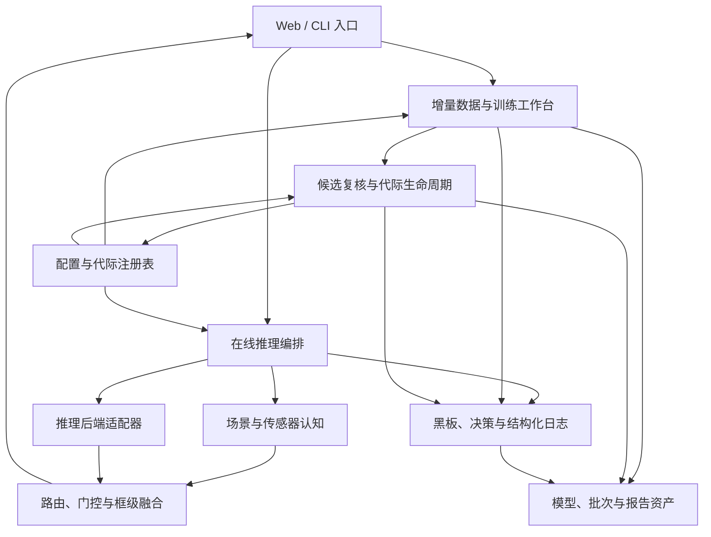

<!-- generated-by: gsd-doc-writer -->
# 系统架构

## 系统概览

灵动Agent 是一个面向 IR/SAR 时变场景目标检测的模块化 Python 单体：Starlette Web 工作台与 `agile-agent` CLI 共享同一套配置、模型代际和业务模块，在线路径接收单张或批量无标签图像并输出检测框、场景/传感器认知及完整决策轨迹，离线路径接收增量数据 ZIP 并产出经过审计、训练、校准、复核后可原子切换的模型代际。系统采用分层与端口适配器风格，将入口层、用例编排、推理后端、策略/融合、状态与审计分开；耗时训练在子进程中执行，生产代际则由受校验的注册表和原子运行时提供器管理。

## 组件图

箭头表示调用、读取或写入方向。



- **入口层**：[`fair_agent/cli.py`](../fair_agent/cli.py) 负责命令解析与调度；[`fair_agent/web/app.py`](../fair_agent/web/app.py) 暴露检测、批处理、增量数据和日志接口，并托管静态前端。
- **在线推理层**：[`fair_agent/modules/web_inference.py`](../fair_agent/modules/web_inference.py) 协调上下文模型、冻结基础检测器、活动增量专家、逐类门控和融合；[`fair_agent/backends/`](../fair_agent/backends/) 隔离 CUDA、历史 TensorRT 兼容接口和 Ascend ACL 的运行时差异。
- **离线增量层**：[`fair_agent/modules/incremental_workbench.py`](../fair_agent/modules/incremental_workbench.py) 管理批次与训练任务，[`fair_agent/modules/incremental_lifecycle.py`](../fair_agent/modules/incremental_lifecycle.py) 串联校准、复核、上线和回滚。
- **控制与证据层**：[`fair_agent/core/`](../fair_agent/core/) 管理配置、黑板、哈希、运行清单和结构化事件；[`fair_agent/modules/model_generations.py`](../fair_agent/modules/model_generations.py) 与 [`fair_agent/modules/generation_management.py`](../fair_agent/modules/generation_management.py) 管理模型所有权和 production 频道。

## 数据流

### 在线单图与批量检测

1. Web 的 `detect` / `batch_detect` 或 CLI 的 `cmd_detect` 读取并校验主配置。`build_web_settings` 随后解析功能模型注册表和当前 production 代际，将基础模型、活动专家、全局类别映射、逐类阈值及后端参数组装为运行时设置。
2. Web 层限制上传格式和置信度并解码图像；支持固定 Ascend 编码输入时可交给设备预处理路径。`AtomicEngineProvider` 延迟创建并复用 `WebInferenceEngine`。
3. `FairInferenceQueue` 将每个在线推理操作放入单工作线程队列，避免同一加速器上下文被并发请求无序访问；引擎内部仍可按配置并行执行场景/传感器模型、冻结基础检测器和可预取的增量专家。
4. `create_backend` 根据配置建立统一推理端口。上下文模型产生 sensor/scene 软证据，基础检测器产生旧类候选，活动代际中的类别增量 owner 及符合条件的目标增量 owner 产生专项候选。路由不会使用训练集或测试集身份，也不会把场景作为目标类别的硬路由条件。
5. 推理编排将各模型的本地类别 ID 映射到全局 ID，应用逐类阈值、正样本原型和跨类冲突规则，再通过 class-aware NMS 生成最终检测框。
6. 返回结果包含上下文、检测框、类别计数、分段耗时、使用过的模型、执行/跳过的专家及融合决策。Web 将关联摘要写入 `StructuredEventLog`；批量结果另存入有容量和 TTL 限制的内存缓存，供预览与 ZIP 下载。

### 增量数据到 production 代际

1. `IncrementalBatchStore` 流式保存 ZIP，执行安全解压、图像/标签校验、类别绑定和历史数据血缘交集检查，并把结果固化到批次 manifest。只有 `AUDITED` 批次可以继续。
2. `inject` 生成只含本轮数据的 train/dev 视图，并把 lock 样本复制到独立的 `sealed_lock` 目录，同时将其排除在训练可访问的 prepared 数据视图之外；划分、文件摘要、全局类别映射和数据指纹随批次保存。
3. `TrainingJobManager.start` 再次复核血缘，冻结 `dataset.yaml`、类别注册表和初始化权重信息，然后启动 `train-worker` 子进程。训练进程只读取该任务快照，输出候选权重、日志和候选 manifest。
4. 训练成功后，`IncrementalLifecycle` 只用增量 dev 完成逐类阈值校准和候选诊断，注册候选代际，并在相应设备配置启用时执行增量专家量化。
5. 候选冻结后，`recheck_generation` 执行 lock、旧类保留率和部署质量复核，并把配置摘要冻结到 manifest。promotion 阶段再校验配置摘要、校准资产路径和哈希；任一门禁失败时 production 保持不变。
6. 通过门禁后先 shadow load 并冒烟验证候选引擎。`AtomicEngineProvider.promote` 在受锁保护的 promotion 流程中先原子替换注册表文件、重建运行时 settings，再把进程内引擎交换为此前已构建的 shadow engine；这不是跨文件与内存的单一事务，已有请求在短暂切换窗口内仍可能取得旧引擎。加载、切换或血缘冻结失败时，生命周期回滚到父代际；所有状态变化都写入批次 manifest 和结构化事件日志。

### 黑板与受控动作

1. `build_blackboard` 汇总数据审计、模型资产、功能模型、代际和提交状态，缺少私有运行产物时只使用脱敏演示状态作为展示回退。
2. `build_decision` 根据黑板阻塞项和固定分数排序候选动作，并把当前上下文附入决策记录；当前上下文本身不参与候选评分。`cmd_pipeline` 只执行配置允许的低风险动作，并校验输出目录白名单。
3. 每次运行保存计划、状态、决策、动作结果和 manifest；这条运维控制流与在线图像检测路由相互独立。

## 关键抽象

| 抽象 | 位置 | 职责 |
| --- | --- | --- |
| `load_config` | [`fair_agent/core/config.py`](../fair_agent/core/config.py) | 加载 YAML、展开环境变量、应用进程级覆盖、校验完整配置并计算有效配置摘要。 |
| `InferenceBackend` / `create_backend` | [`fair_agent/backends/inference.py`](../fair_agent/backends/inference.py) | 定义单图、批量与耗时接口，并按配置创建 Ultralytics CUDA、TensorRT 兼容或 Ascend ACL 后端。 |
| `WebInferenceEngine` | [`fair_agent/modules/web_inference.py`](../fair_agent/modules/web_inference.py) | 持有上下文模型、基础模型、增量专家和推理队列，完成路由、门控、类别映射、融合及决策轨迹生成。 |
| `AtomicEngineProvider` | [`fair_agent/web/app.py`](../fair_agent/web/app.py) | 延迟初始化在线引擎；在受锁保护的 promotion/rollback 流程中更新注册表并交换进程内引擎，但不提供跨文件与内存的单一事务。 |
| `IncrementalBatchStore` | [`fair_agent/modules/incremental_workbench.py`](../fair_agent/modules/incremental_workbench.py) | 持久化增量批次，安全解压与审计数据，维护稳定类别绑定并生成 train/dev/lock 视图。 |
| `TrainingJobManager` | [`fair_agent/modules/incremental_workbench.py`](../fair_agent/modules/incremental_workbench.py) | 冻结训练快照、启动和取消训练子进程、维护任务状态，并在成功后进入自动生命周期。 |
| `IncrementalLifecycle` | [`fair_agent/modules/incremental_lifecycle.py`](../fair_agent/modules/incremental_lifecycle.py) | 编排 dev 校准、候选注册、诊断、可选量化、lock 复核、shadow load、晋升和失败回滚。 |
| `load_generation_registry` / `generation_web_settings` | [`fair_agent/modules/model_generations.py`](../fair_agent/modules/model_generations.py) | 校验代际、类别所有权、权重哈希、阈值和验收状态，并把指定频道解析成在线推理设置。 |
| `build_blackboard` / `build_decision` | [`fair_agent/core/blackboard.py`](../fair_agent/core/blackboard.py)、[`fair_agent/policies/decision.py`](../fair_agent/policies/decision.py) | 将可验证证据汇总为状态，再产生带风险等级、阻塞原因和执行权限的运维动作。 |
| `StructuredEventLog` | [`fair_agent/core/runtime_log.py`](../fair_agent/core/runtime_log.py) | 提供线程安全 JSONL 事件、敏感字段脱敏、文件轮转和按关联标识查询。 |

## 目录结构与组织原则

```text
fair_agent/
├── cli.py                 # CLI 入口与命令调度
├── backends/              # 推理端口及各设备后端适配器
├── core/                  # 配置、黑板、哈希、审计与结构化日志
├── models/                # Scene-SensorNet 定义、加载与评测
├── modules/               # 在线推理、增量学习、代际和部署用例
├── policies/              # 基于黑板的动作选择策略
├── executors/             # 带日志和超时的本地动作执行
├── web/                   # Starlette API 与静态 Web 前端
└── ui/                    # 终端工作台
configs/                   # 运行时、实验、模型与设备 YAML
models/                    # 发布模型、功能/代际注册表和验收元数据
splits/                    # 受版本控制的固定数据划分清单
native_ascend/             # Ascend 310B C ABI、CMake 与 contract stub
native/                    # 历史 x86 原生兼容后端
scripts/                   # 环境、启动、导出和发布检查入口
tools/                     # 数据准备、训练、推理与板前验证工具
tests/                     # 单元、集成与 Web 流程回归测试
docs/                      # 操作、实验、部署与架构文档
archive/                   # 不参与当前运行的历史划分
demo_artifacts/            # 不含原始样本的展示回退状态
```

这种组织把稳定基础设施放在 `core/`，把硬件差异限制在 `backends/`，把可组合业务流程集中在 `modules/`，入口层只负责参数、协议与错误转换。发布资产和可复现配置由 `models/`、`configs/`、`splits/` 跟踪；可变的 `data/`、`runs/`、`reports/` 与 `build/` 被 Git 忽略，分别承载批次/运行时状态、实验或设备产物、审计报告和本机构建结果。由此可在不修改 Web/CLI 用例的前提下替换推理后端，也能在不覆盖已发布资产的情况下审计和回滚模型代际。
