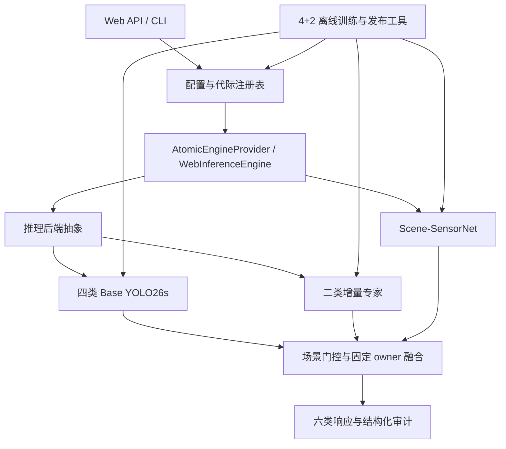

<!-- generated-by: gsd-doc-writer -->
# 系统架构

## 系统概览

AgileAgent 是面向 4+2 多模态目标检测的分层 Python 系统。系统接收 IR/SAR 图像、五列 YOLO 增量数据包以及 YAML 配置，统一编排 Scene-SensorNet、四类 Base YOLO26s 和增量检测专家，输出六类检测结果、场景与传感器概率、路由轨迹、模型代际和审计事件。x86/CUDA 与 Ascend310B1 共用配置 schema、类别所有权、代际和 API 语义，推理执行分别由 Ultralytics CUDA 后端和 Ascend ACL 三-OM 后端完成。

## 组件图



主要边界如下：

- 接口层由 `fair_agent/cli.py` 和 `fair_agent/web/app.py` 提供命令行、Starlette API、静态工作台、健康检查和增量数据入口。
- 编排层由 `fair_agent/modules/web_inference.py` 负责模型调度、局部到全局类别映射、场景门控、冲突仲裁和 class-aware NMS。
- 后端层由 `fair_agent/backends/inference.py` 与 `fair_agent/backends/ascend_acl.py` 隔离 CUDA、TensorRT 和 Ascend ACL 的执行细节。
- 状态层以 `models/generations.json`、`configs/functional_models.yaml`、`data/incremental_batches/` 和 `reports/agent_logs/` 保存 production 身份、模型职责、增量批次和审计事件。
- 离线工具层以 `tools/`、`scripts/` 和 `splits/strict_4plus2/` 固化训练、逐轮增量、系统校准、评分和发布流程。

## 模型职责与类别所有权

三个功能模型在两种运行平台上保持相同职责：

| 功能模型 | x86/CUDA 资产 | Ascend310B1 v2 资产 | 输出与职责 |
| --- | --- | --- | --- |
| Scene-SensorNet | `models/context/scene_sensor_net.pt` | `models/ascend310b/full-score/20260823-4plus2-yolo26-content-gate-v2/om/scene_sensor_net.om` | IR/SAR 概率及 air、forest、sea、urban 闭集场景概率 |
| 四类 Base YOLO26s | `models/production/incremental_detection/four_class_base_detector.pt` | `models/ascend310b/full-score/20260823-4plus2-yolo26-content-gate-v2/om/base_detector.om` | 全局类 0–3 |
| 二类增量 YOLO26s | `models/production/incremental_detection/incremental_detector.pt` | `models/ascend310b/full-score/20260823-4plus2-yolo26-content-gate-v2/om/incremental_detector.om` | 全局类 4–5 |

类别所有权由 `models/generations.json` 固定：

| 全局类 | 类别 | owner |
| ---: | --- | --- |
| 0 | soldier | `four_class_base_detector` |
| 1 | small_aircraft | `four_class_base_detector` |
| 2 | warship | `four_class_base_detector` |
| 3 | tank | `four_class_base_detector` |
| 4 | patrol_boat | `incremental_detector` |
| 5 | armored_vehicle | `incremental_detector` |

Base 本地类 0–3 直接映射到全局类 0–3，增量专家本地类 0–1 映射到全局类 4–5。场景模型只提供概率证据，不改变类别所有权。

## 在线推理数据流

### 公共启动流程

1. `select_runtime_config()` 将 `x86_64/AMD64` 映射到 x86/CUDA 配置，将 `aarch64/ARM64` 映射到 ARM/Ascend 配置；显式 `--config` 与 `AGILE_AGENT_CONFIG` 可固定选择。
2. `load_config()` 加载 schema 3 配置并完成环境变量展开、路径解析、字段校验和运行平台元数据登记。
3. `build_web_settings()` 读取功能模型注册表和 production 代际，按后端把 Base、Incremental、Scene-SensorNet 自动解析为 `.pt` 或 `.om` 运行资产，并整理类别映射、阈值、场景先验及后端配置。
4. `AtomicEngineProvider` 按需构建 `WebInferenceEngine`，预热三个功能模型，并在代际提升或回滚时原子替换运行实例。
5. `/api/detect`、`/api/batch` 或 CLI `detect` 将请求交给 `FairInferenceQueue`，由单一设备队列保持推理请求的执行顺序。

### x86/CUDA

```text
图像解码
  -> Scene-SensorNet 与四类 Base 并行执行
  -> 场景概率与 Base 检测双证据内容门控
  -> 按门控结果执行或跳过二类增量专家
  -> Base 与专家输出映射到全局类别
  -> 按已冻结的逐类阈值和场景亲和度计算有效阈值
  -> 固定 owner 合并与跨类冲突仲裁
  -> class-aware NMS
  -> 全类别最高置信度重叠抑制
  -> 六类检测、场景信息、路由轨迹和耗时
```

`configs/agent_pipeline.yaml` 选择 `ultralytics_cuda`，检测输入尺寸为 1280。`models/generations.json` 保存六类逐类阈值、Base/Increment 场景先验和软阈值惩罚；`WebInferenceEngine` 对所有候选应用同一套冻结运行参数。最后一层重叠抑制不区分类别对或数据划分：不同类别框满足配置的 IoU/包含关系时，贪心保留最高置信度框，并把删除原因写入 `fusion_summary`。

### Ascend310B1 v2

```text
640×512 PNG
  -> bounded multipart 与 DVPP encoded preprocessing
  -> Scene-SensorNet 和四类 Base 异步提交
  -> 收集场景概率与 Base 检测
  -> air 概率与 small_aircraft 检测双证据内容门控
  -> 按门控结果执行或跳过二类增量专家
  -> 固定 owner 融合与 class-aware NMS
  -> 全类别最高置信度重叠抑制
  -> 六类 API 响应和 ACL/DVPP 耗时
```

`configs/agent_pipeline_ascend310b.yaml` 选择 `ascend_acl` 和 `independent_yolo26_e2e_v1`。Base 与 Incremental OM 接收 uint8 NHWC `[1,608,736,3]`，各自输出 `[1,300,6]`；Scene-SensorNet OM 接收 uint8 NHWC `[1,160,160,3]`。内容门控策略为：当 `air >= 0.5` 且 Base 检出 `small_aircraft` 时跳过增量专家，其余输入执行增量专家。

正式包 `models/ascend310b/full-score/20260823-4plus2-yolo26-content-gate-v2/` 自包含三个 OM、正式配置、源 checkpoint、ONNX、AIPP、ATC 日志、构建来源和冻结验证报告。板端主实例监听内部 `18501`，loopback 路由将公共 `8501` 指向主实例，`8502` 用于隔离候选。

## 训练、增量与发布数据流

### x86/CUDA 4+2

```text
strict_4plus2 Base train/dev
  -> tools/04 训练 Base 候选
  -> tools/05 选择四类 Base
  -> 冻结 Base 权重

increment train/dev
  -> tools/11 生成逐轮类别视图
  -> tools/06 与 tools/07 训练、选择当轮专家
  -> tools/08 累计评估截至当轮的全部类别
  -> tools/13 登记父子代际候选
  -> tools/12 汇总两轮证据

Base/Increment train/dev 与 mixed dev
  -> tools/60 与 tools/61 训练、选择 Scene-SensorNet
  -> tools/09 搜索冻结场景门控与逐类阈值
  -> tools/10 提升正式 4+2 production
```

`configs/incremental_round_registry_4plus2.yaml` 是类别与轮次的权威注册表。它定义 Base 四类、`round_01_patrol_boat`、`round_02_armored_vehicle`、每轮局部到全局映射、父子代际和 train/dev/lock 清单。每轮增量训练只读取当轮 Increment train/dev 视图；Base 与已学专家权重保持冻结。Scene-SensorNet 与场景门控属于 `system_calibration`，冻结参数后的累计评分属于 `joint_evaluation`。

### Ascend310B1 v2 发布

```text
冻结的 Base / Incremental / Scene 权重
  -> build_ascend_yolo26_e2e_oms.sh 构建检测 OM
  -> tools/112 物化三-OM 候选
  -> run_ascend310b_score_gate.sh 冻结预测并完成精度与性能门禁
  -> tools/111 生成 validated 正式包
  -> materialize_ascend310b_full_score_release.sh 物化板端 release
  -> install_ascend310b_primary_services.sh 安装主实例与原子路由
```

`fair_agent/modules/ascend_release.py` 校验正式配置、三项 OM 身份、构建清单和验证报告之间的引用关系；`scripts/manage_ascend310b_primary_route.sh` 管理公共端口到主实例的精确路由。

## 关键抽象

| 抽象 | 位置 | 作用 |
| --- | --- | --- |
| `select_runtime_config()` / `load_config()` | `fair_agent/core/config.py` | 识别 x86/ARM，选择平台配置并加载、覆盖、校验运行配置 |
| `load_generation_registry()` / `generation_web_settings()` | `fair_agent/modules/model_generations.py` | 验证权重身份、类别 owner、阈值和代际通道，并生成在线设置 |
| `AtomicEngineProvider` | `fair_agent/web/app.py` | 延迟构建推理引擎，执行 shadow 加载后的原子提升与回滚 |
| `WebInferenceEngine` | `fair_agent/modules/web_inference.py` | 编排场景模型、Base、增量专家、门控、融合和批量推理 |
| `InferenceBackend` / `create_backend()` | `fair_agent/backends/inference.py` | 为 Ultralytics CUDA、TensorRT 与 Ascend ACL 提供统一检测接口 |
| `AscendAclRuntime` / `AscendAclBackend` | `fair_agent/backends/ascend_acl.py` | 管理 ACL context、stream、OM、DVPP、异步执行和 E2E 检测输出 |
| `SceneSensorNet` | `fair_agent/models/context.py` | 共享卷积特征并输出传感器与场景两个分类头 |
| `IncrementalBatchStore` / `TrainingJobManager` | `fair_agent/modules/incremental_workbench.py` | 审计上传数据、生成隔离视图、保存批次状态并管理训练任务 |
| `IncrementalLifecycle` | `fair_agent/modules/incremental_lifecycle.py` | 串联 dev 校准、候选登记、lock 复核、shadow 加载和 production 切换 |
| `load_incremental_round_registry()` | `fair_agent/modules/incremental_round_registry.py` | 校验两轮类别注入、数据范围、冻结条件和父子代际契约 |

## 配置与状态边界

| 文件或目录 | 权威内容 |
| --- | --- |
| `configs/agent_pipeline.yaml` | x86/CUDA 服务、推理、路由、工作台和门禁配置 |
| `configs/agent_pipeline_ascend310b.yaml` | Ascend310B1 v2 服务、OM、DVPP、执行顺序和验证配置 |
| `configs/functional_models.yaml` | 三个功能模型的职责、平台资产与协作关系 |
| `configs/incremental_round_registry_4plus2.yaml` | Base 与两轮新增类别的顺序、映射和数据协议 |
| `models/generations.json` | production/candidate 通道、模型成员、类别 owner、阈值和代际指标 |
| `splits/strict_4plus2/` | Base、Increment、mixed 及逐轮 train/dev/lock 固定清单 |
| `data/incremental_batches/` | 上传包、审计结果、训练视图、任务状态和批次级类别注册表 |
| `reports/agent_logs/` | 以 trace、batch、job 和 generation 标识串联的结构化运行事件 |

## 目录结构与职责

```text
AgileAgent/
├── fair_agent/
│   ├── core/          配置、审计、运行日志和状态基础设施
│   ├── backends/      CUDA、TensorRT 与 Ascend ACL 推理适配器
│   ├── models/        Scene-SensorNet 等模型定义与加载逻辑
│   ├── modules/       推理融合、增量生命周期、代际和发布业务逻辑
│   └── web/           Starlette API、静态工作台和运行时切换入口
├── configs/           x86、Ascend、功能模型和增量轮次配置
├── models/            production 权重、代际注册表与 Ascend310B1 v2 发布包
├── splits/            strict 4+2 固定数据清单
├── tools/             数据处理、训练、评测、候选物化和设备验收入口
├── scripts/           环境准备、服务启动、模型构建、发布和路由脚本
├── native/            x86 TensorRT 原生后端接口
├── native_ascend/     Ascend 原生接口契约
├── tests/             配置、运行时、增量与 Ascend 发布回归
└── docs/              当前架构、配置、开发、测试和部署文档
```

该结构将平台无关的业务编排放在 `fair_agent/modules/`，将设备差异收敛到 `fair_agent/backends/`，并让训练资产、运行配置、固定数据清单和可部署模型包分别保持独立、可验证的边界。
