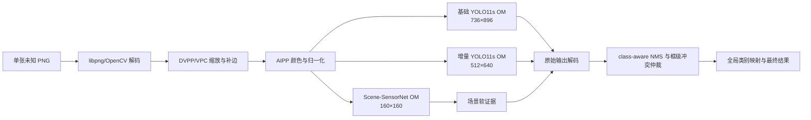

# Ascend 310B 稳定加速设计

本文固定 AgileAgent 在 12 GB 内存、标称 20 TOPS 的 Ascend 310B 设备上的首选部署方案、精度边界和验收方法。它是后续实现与板端联调的设计基线，不表示仓库当前已经具备 Ascend 推理能力。

> 状态：设计与板前 ONNX 验证已完成，硬件型号、OM 与板端性能待验证
> 基线日期：2026-08-08
> 适用范围：当前 3+1 模拟增量模型，以及后续采用相同输入、标注和 Agent 协议重新训练的官方增量模型

## 1. 结论

首选方案如下：

1. 三个模型分别导出为固定形状、`batch=1`、输出原始张量且不在图内执行 NMS 的 ONNX，再用 ATC 编译为 OM。当前已验证输入为基础 `736×896`、增量 `512×640`、场景 `160×160`。
2. 推理关键路径使用原生 C++ AscendCL，不用 Python 或训练框架承载板端在线推理。
3. 基础检测器、增量检测器和 Scene-SensorNet 全部常驻设备内存；任何未知输入图像都运行两个检测 owner，场景模型只提供软证据。
4. PNG 解码后使用 DVPP/VPC 完成缩放与补边，AIPP 只负责颜色与归一化；若目标硬件或 CANN 版本不支持 PNG 硬解码，则使用 libpng/OpenCV 解码后进入 VPC。
5. 为三个模型分配独立 stream/model ID，配合 2 至 3 槽环形缓冲区和异步事件同步。必须实测串行、双路并发和三路并发，冻结该设备上 P95 最优的调度方式。
6. 首版使用混合 FP16。只有当原生 FP16 端到端性能仍不达标时，才进入受控 PTQ；不得为了峰值 TOPS 直接全模型 INT8。
7. 单图 `batch=1` 必须独立达到性能要求，不能依靠 `batch=20` 的吞吐掩盖单图延迟。

赛题最低目标是 30 FPS。本方案把工程验收目标固定为端到端平均吞吐不低于 36 FPS、P95 不高于 33.33 ms，以覆盖解码、预处理、模型执行、NMS、融合和调度开销，并给温度波动与长期运行留出余量。

## 2. 当前基线与风险边界

当前 production 每张图都执行三个模型：

| 模型 | 作用 | 输入 | PT 权重大小 | 当前精度证据 |
| --- | --- | --- | ---: | --- |
| YOLO11s 基础检测器 | 冻结旧类别 owner | `1×3×736×896` | 18.33 MiB | 基础 mAP50 `0.814142` |
| YOLO11s 增量检测器 | 新类别 owner | `1×3×512×640` | 18.28 MiB | New-mAP50 `0.638688` |
| Scene-SensorNet | IR/SAR 与已知场景软证据 | `1×3×160×160` | 0.75 MiB | 独立上下文模型，不能用于硬路由 |

增量后 KRR 为 `1.000000`，当前部署门禁还包括新类 precision `0.924528` 和 70 张旧类图上的误激活率 `0.014286`。这些结果来自当前 750 张图的固定模拟划分，不代表官方隐藏测试成绩。

两个正式精度指标的余量较小：基础 mAP50 仅高出满分线约 `0.0141`，New-mAP50 仅高出满分线约 `0.0387`。因此部署顺序必须是“先做数值等价的 FP16 迁移，再按真实性能决定是否量化”。

三个 PT 权重合计约 37.36 MiB，12 GB 内存足以容纳权重，但 PT 文件大小不能代表 OM 的真实内存占用。上线前必须用 `aclmdlQuerySize` 查询每个 OM 的权重与工作内存，并结合 `npu-smi` 记录三模型常驻、缓冲区和 DVPP 内存的峰值。

按当前固定矩形输入估算，三模型总计算量约为 51.9 GFLOPs/图，30 FPS 对应约 1.56 TOPS 的有效计算需求。相较方形 `896/640` 输入，两个检测分支的输入面积分别减少约17.9%和20%。该估算只用于判断方向可行，不是性能承诺；设备标称的20 TOPS通常对应特定精度和理想算子，不能直接等同于混合 FP16 的端到端吞吐。

## 3. 固定运行架构



### 3.1 模型执行语义

- 基础检测器和所有活动增量检测器必须处理每一张输入图像。
- 不允许先判断图像是“旧类图”还是“新类图”再选择模型。
- 不允许依据文件名、测试清单、标注、目录或图像 stem 路由。
- Scene-SensorNet 只提供软阈值证据，不能跳过任一检测器，也不能把未知场景直接解释为新类别。
- 基础 owner 继续负责全局类别 `0/1/3`，当前增量 owner 负责全局类别 `2`；后续官方新增类别只替换映射和模型资产，不改变运行模板。
- 框级融合必须复现当前 production profile 中冻结的激活阈值、类别映射、IoU 和冲突仲裁规则。

这组约束既是精度要求，也是防止评测作弊和数据泄露的部署要求。

### 3.2 进程与内存

首版采用单进程、单设备上下文：

- 启动时一次性加载三个 OM，不在请求间卸载。
- 每个模型拥有独立 model ID、stream、输入输出 dataset 和复用缓冲区。
- 使用 2 至 3 槽环形缓冲区重叠“解码/预处理、设备执行、后处理”。
- 通过 event 或 stream 同步只等待当前图像所需的结果，禁止在每一小步执行全设备同步。
- 模型、缓冲区或 DVPP 初始化失败时直接进入 Not Ready，不静默回退到 CPU。

## 4. 首次上板必须确认的硬件信息

“310B”包含多个产品与 SoC 变体，不能预先把 ATC 的 `--soc_version` 写死为 `Ascend310B4`。首次上板先保存以下输出：

```bash
npu-smi info
npu-smi info -m
atc --version
cat /usr/local/Ascend/ascend-toolkit/latest/version.cfg
uname -m
```

选择规则：

1. `--soc_version` 按目标设备报告的 `Name` 和当前 ATC 文档支持值确定。
2. 固件、驱动和 CANN 必须使用设备厂商支持的同一兼容矩阵。
3. OM 的转换环境可以与板端分离，但板端运行 CANN 不能旧于转换环境所要求的版本。
4. 不跨设备复用未经验证的 OM；ONNX 可以作为可移植中间资产，OM 在目标软件/硬件组合上重编译。

## 5. ONNX 与 OM 契约

### 5.1 固定形状

首版固定三个输入：

| 资产 | 输入形状 | Batch | 图内 NMS | 输出 |
| --- | --- | ---: | --- | --- |
| `base_detector.onnx/.om` | `1,3,736,896` | 1 | 禁用 | `1,7,13524` 原始 YOLO 输出 |
| `incremental_detector.onnx/.om` | `1,3,512,640` | 1 | 禁用 | `1,5,6720` 原始 YOLO 输出 |
| `scene_sensor_net.onnx/.om` | `1,3,160,160` | 1 | 不适用 | sensor logits、scene logits |

固定形状能减少动态 shape 管理、编译回退和运行期 workspace 波动。后续只有在官方输入规格确实要求多尺寸时，才新增独立 profile 或 OM；不要先引入动态 shape。

### 5.2 ATC 编译模板

实际输入名以导出的 ONNX 图为准。以下命令只展示固定参数结构：

```bash
SOC_VERSION="<npu-smi 与 ATC 文档确认的值>"

atc \
  --model=runs/ascend310b/onnx/rect/base_detector.onnx \
  --framework=5 \
  --output=runs/ascend310b/om/base_detector \
  --input_format=NCHW \
  --input_shape="images:1,3,736,896" \
  --soc_version="${SOC_VERSION}" \
  --precision_mode_v2=mixed_float16
```

增量模型改为 `1,3,512,640`，场景模型改为 `1,3,160,160`。精度参数按 CANN 版本二选一：

- 新版 CANN：`--precision_mode_v2=mixed_float16`
- 旧版 CANN：`--precision_mode=allow_fp32_to_fp16`

不能同时传入两个精度参数。编译日志中的不支持算子、Host 回退、精度降级和动态 shape 警告都必须清零或形成明确的验收记录。

ONNX、OM、编译日志和板端 profile 都属于设备侧可重建产物，放在 Git 已忽略的 `runs/` 下，不提交到仓库。模型身份以 Git 中的 production 权重、profile 和提交版本为准，不增加人工哈希核对步骤。

## 6. 预处理等价性

当前 750 张本地图像已核实为 PNG，尺寸全部是 `640×512`。板端预处理必须复现训练/评测链路的 RGB 顺序、插值、rounding 和 padding 值。

两个 YOLO 分支都应把解码结果转换为 RGB，按 NCHW 排列并缩放到 `[0,1]`；检测缩放使用与当前 OpenCV letterbox 一致的双线性插值。任何 BGR/RGB 互换、整数截断或重复归一化都会直接改变检测输出。

### 6.1 基础检测器

对 `640×512` 输入：

1. 等比例缩放到约 `896×717`。
2. 水平方向不补边。
3. 按 stride 32 的 `rect/auto` 规则垂直补到 `896×736`，padding 值为 `114`，上边9像素、下边10像素。

方形输入会产生89/90像素补边，但已验证固定方案不采用该形状。9/10来自 Ultralytics 对 stride 余数和奇数总 padding 的取整规则，不能简单改成两侧相同后裁切。

### 6.2 增量检测器

对 `640×512` 输入不缩放；宽高已经满足 stride 32，固定输入直接是 `640×512`，不再添加无效方形补边。

### 6.3 Scene-SensorNet

当前 PyTorch 评测变换为：

1. RGB 图像直接 resize 为 `176×176`。
2. 中心裁剪为 `160×160`。
3. 转为浮点张量。
4. 每通道使用 `mean=0.5`、`std=0.25` 归一化。

Scene-SensorNet 的 resize 是指定二维尺寸，不是保持原始宽高比的短边缩放。

### 6.4 DVPP/VPC 与 AIPP 分工

- VPC：缩放、letterbox、裁剪和 padding。
- AIPP：颜色空间转换、通道排列、数值缩放和归一化。
- PNG：先确认该型号与 CANN 版本的硬件解码支持；若不支持，固定使用 libpng/OpenCV 软件解码，随后把解码结果交给 VPC。

实现完成后，至少抽取不同传感器、场景和目标尺度的真实训练图，对比 PyTorch 与板端预处理张量、还原框坐标和最终预测。小目标对插值与半像素差异敏感，不能只看肉眼图像是否相似。

## 7. 调度与性能预算

### 7.1 固定验收目标

| 指标 | 要求 |
| --- | ---: |
| 输入模式 | 单图、`batch=1` |
| 端到端平均吞吐 | `≥36 FPS` |
| 端到端 P95 | `≤33.33 ms` |
| 官方最低吞吐 | `≥30 FPS` |
| 连续稳定性 | 1 小时无错误、无持续降频、无内存增长 |

当前通用配置中的 `target_p95_ms: 50` 是 x86/API 基线，不作为 310B 板端验收线。实现 Ascend profile 时应单独固定上述更严格门槛。

端到端计时必须包含：真实 PNG 读取与解码、三路预处理、Host/Device 必要传输、三个 OM、YOLO 解码、NMS、软场景融合和结果序列化。只报告 OM 内核耗时或批量吞吐不算通过。

### 7.2 调度候选

按同一批真实图像依次测量：

1. 三模型串行。
2. 基础与增量检测器并发，场景模型串行。
3. 三模型完全并发。

Ascend 的并发收益受 AI Core、内存带宽、DVPP 和 stream 调度影响，CUDA 上的 `parallel_model_execution: true` 不能直接照搬为板端最优结论。选择规则是：在精度完全一致的前提下，以端到端 P95 为第一排序项，以平均 FPS 和温度稳定性为第二排序项，冻结最优方式。

### 7.3 预热

- 加载完成后用真实训练图执行完整链路预热，至少 20 次。
- 预热必须覆盖解码、三种预处理、三个 OM 和后处理，不能只空跑模型。
- 最近一段延迟变异稳定后才把服务状态切为 Ready。
- 新增 OM 上线时先 shadow-load、预热并自检，再原子切换；失败立即保留上一代。

## 8. 精度与量化策略

### 8.1 第一阶段：混合 FP16

先完成固定形状混合 FP16 的端到端迁移。它必须满足：

- 基础 mAP50 `≥0.80`
- New-mAP50 `≥0.60`
- KRR `≥0.95`
- 新类 precision `≥0.90`
- 70 张旧类图上的新类误激活率 `≤0.05`

建议同时记录相对 PyTorch 基线的总体 mAP50 差值与逐类 AP 差值；任何指标即使只下降少量，只要跨过上述硬门槛就必须拒绝上线。

### 8.2 第二阶段：受控 PTQ，仅在性能不足时启用

若 FP16 原生链路仍无法达到性能目标，使用 msModelSlim 对 ONNX 做真实样本 PTQ：

- CNN 权重采用 signed INT8、per-channel。
- 基础检测器校准只读取 `splits/strict_3plus1/base_train.txt`。
- 增量检测器校准只读取 `splits/strict_3plus1/increment_train.txt`。
- Scene-SensorNet 校准只读取 `splits/strict_3plus1/scene_train.txt`。
- 新类部署阈值只允许用 `splits/strict_3plus1/increment_dev.txt` 重新校准。
- 禁止用 `base_test.txt`、`mixed_test.txt`、lock 标签或官方测试数据做校准、选层或调阈值。

量化顺序：

1. 先量化卷积 backbone。
2. Detect head、DFL/Softmax、Sigmoid 和最终输出层优先保留 FP16。
3. 每扩大一次 INT8 范围，都重新执行完整精度、误激活和性能验收。
4. 任何候选不通过就回退到上一组混合精度配置，不继续扩大范围。

不采用“一次性全 INT8”或只看单模型 cosine similarity 的上线方式。

## 9. 评测合规与无泄露验收

板端评测必须保持仓库当前的无标签语义：

1. 先冻结 OM、阈值、预处理和融合规则。
2. 基础与增量 owner 对完整 89 张 `mixed_test` 执行同一条无标签链路。
3. 推理完成并保存全部原始与融合预测后，评分器才能读取 `base_test.txt` 和测试标签。
4. 基础 mAP50 只在 70 张纯旧类图像上计分。
5. New-mAP50 与 KRR 在完整 89 张旧类加新类混合集上计算。
6. 对比输入 stem 集合，确认两个检测 owner 都等于完整 `mixed_test`。
7. 检查日志，确认没有文件名路由、标签路由或场景硬路由。

后续官方增量数据到达时，只替换新增类别映射、训练清单、增量权重和由增量 train/dev 得到的软先验与阈值；上述推理和验收语义保持不变。

## 10. 板端验收流程

### 阶段 A：单模型正确性

- 导出并检查三个固定形状 ONNX。
- 分别编译三个 OM，记录 ATC 与 SoC 信息。
- 使用相同输入保存 PyTorch、ONNX 和 OM 原始输出。
- 对齐预处理张量、logits、YOLO 解码和还原框坐标。

### 阶段 B：单模型性能

- 用 `msit benchmark` 测每个 OM 的纯执行平均值、P50、P95 和吞吐。
- 查询 `aclmdlQuerySize`，记录模型内存与工作内存。
- 记录设备利用率、温度、功耗和频率。

`msit benchmark` 只用于定位单模型，不替代完整 Agent 验收。

### 阶段 C：完整 Agent

- 接入原生 AscendCL 后端。
- 跑串行、双路并发和三路并发矩阵。
- 在完整测试协议上重算五项精度/质量门禁。
- 用真实 PNG、`batch=1` 测量端到端平均值、P50、P95、P99 和 FPS。

### 阶段 D：稳定性

- 完整链路预热至少 20 次。
- 连续运行 1 小时。
- 记录解码、预处理、传输、各 OM、NMS/融合和序列化的分段耗时。
- 记录峰值内存、温度、频率与是否出现热降频。
- 验证模型热切换失败时能原子回滚，且不存在静默 CPU fallback。

只有阶段 A 至 D 全部通过，Ascend 310B 状态才能从“待硬件验证”改为“可用”。

## 11. 性能仍不达标时的结构级备选

如果两个 YOLO OM 即使经过原生 AscendCL、固定 shape 和受控混合精度仍不能达到 30 FPS，优先考虑共享主干，而不是继续牺牲精度：

1. 冻结基础 YOLO 的 backbone、neck 和旧类 head。
2. 只使用增量数据训练轻量 adapter/新增类 head。
3. 单次计算共享 P3/P4/P5 特征，再分别执行旧类 head 和新增类 head。

这能去掉一次完整 YOLO backbone/neck，是计算量降幅最大的备选，同时结构上保留旧类分支。但它需要重新训练，且必须重新通过基础 mAP50、New-mAP50、KRR、precision、误激活率和无泄露验收，不能作为不经验证的部署替换。

## 12. 预期代码与资产边界

仓库已经新增独立 Ascend 契约目录，没有把现有 TensorRT/CUDA `native/` 代码改造成条件分支堆叠：

```text
native_ascend/
├── CMakeLists.txt
├── include/              # 已冻结的整体管线 C ABI
└── src/                  # 当前为无CANN contract stub；到板后替换为ACL实现

runs/ascend310b/
├── onnx/                 # 可重建，不入 Git
├── om/                   # 设备相关，不入 Git
├── compile_logs/         # 本地诊断
└── benchmarks/           # 板端验收报告
```

仓库提交：后端契约源码、导出/对齐/性能工具、自动化测试和不含竞赛数据的验收说明。仓库不提交：OM、ONNX、golden真实图片、设备日志、标签、运行缓存或 CANN 安装包。

## 13. 板前 WSL 验证结果

使用 WSL Ubuntu 20.04、RTX 4060 Laptop、PyTorch 2.5.1、Ultralytics 8.4.92、ONNX 1.17 和 ONNX Runtime 1.23.2 CUDA Provider，已完成：

```bash
python tools/90_ascend_preflight.py export --shape-mode rect --device 0
python tools/90_ascend_preflight.py raw-align --shape-mode rect --device 0 --samples 6
python tools/90_ascend_preflight.py metric-align --shape-mode rect --device 0
python tools/90_ascend_preflight.py golden --shape-mode rect --device 0 --samples 6
python tools/90_ascend_preflight.py benchmark --shape-mode rect --device 0 \
  --samples 6 --warmup 20 --rounds 30
```

三个 ONNX 均为固定 Batch=1、无动态维度、无图内 NMS。dev 样本覆盖基础类与新增类；原始输出归一化最大误差小于 `10⁻³`。完整89张混合集在所有 owner 无标签推理并冻结融合结果后才读取标签，结果如下：

| 指标 | 同形状 PyTorch | ONNX Runtime CUDA | ONNX-PyTorch 差值 |
| --- | ---: | ---: | ---: |
| 基础 mAP50 | `0.814118` | `0.814197` | `+0.000079` |
| New-mAP50 | `0.638688` | `0.638688` | `0` |
| KRR | `1.000000` | `1.000000` | `0` |
| 新类 precision | `0.924528` | `0.924528` | `0` |
| 旧类图误激活率 | `0.014286` | `0.014286` | `0` |

最大指标绝对差为 `9.8×10⁻⁵`，五项门禁全部通过。golden bundle 位于 `runs/ascend310b/golden/rect/`，包含3张无标签代表图、三路输入张量和 ONNX 原始输出，供板端逐元素对齐；该目录被 Git 忽略。

RTX 4060 的 ONNX Runtime 代理性能仅用于验证计时框架，不能代表310B：

| 调度 | 平均总延迟 | P95 | 按平均值折算 FPS |
| --- | ---: | ---: | ---: |
| 串行 | `51.04 ms` | `57.20 ms` | `19.59` |
| 两检测器并行 | `49.85 ms` | `58.73 ms` | `20.06` |
| 三模型并行 | `44.79 ms` | `48.69 ms` | `22.33` |

三模型并行的平均分段约为预处理 `20.04 ms`、模型 `18.68 ms`、后处理 `6.07 ms`。这说明板端必须通过 VPC/AIPP、缓冲区复用和原生后处理压缩主机开销；它不证明310B能或不能达到30 FPS。

原生 C ABI contract stub 也已在 WSL 用 GCC 9.4/CMake 3.16 构建并通过 smoke：ABI版本1、Ready=false、warmup/predict明确失败、无CPU回退。真实 AscendCL 实现必须保持该 ABI。

## 14. 官方参考资料

- [ATC `--soc_version` 参数](https://www.hiascend.com/document/detail/zh/CANNCommunityEdition/latest/devaids/atctool/atlasatcparam_16_0036.html)
- [ATC `--input_shape` 参数](https://www.hiascend.com/document/detail/zh/CANNCommunityEdition/latest/devaids/atctool/atlasatcparam_16_0016.html)
- [ATC 精度模式](https://www.hiascend.com/document/detail/zh/CANNCommunityEdition/latest/devaids/atctool/atlasatcparam_16_0069.html)
- [AscendCL 异步执行约束](https://www.hiascend.com/document/detail/zh/canncommercial/800/apiref/appdevgapi/aclcppdevg_03_0299.html)
- [DVPP/VPC 组合预处理](https://www.hiascend.com/document/detail/en/CANNCommunityEdition/900/programug/acldevg/aclcppdevg_000080.html)
- [msModelSlim](https://github.com/Ascend/msmodelslim)
- [msIT benchmark](https://github.com/Ascend/msit/blob/master/msit/docs/benchmark/README.md)

## 15. 实施前检查单

- [ ] 已取得五条硬件/软件识别命令输出。
- [ ] 已按厂商兼容矩阵冻结固件、驱动和 CANN。
- [x] 三个 ONNX 均为固定 shape、batch=1、原始输出且无图内 NMS。
- [ ] 三个混合 FP16 OM 编译无算子回退和未解释警告。
- [x] 本机参考预处理、PyTorch 与 ONNX Runtime 原始输出已对齐。
- [ ] 板端 DVPP/VPC/AIPP 输出与 golden bundle 逐张对齐。
- [ ] 三个 OM 常驻内存，峰值低于安全水位。
- [ ] 已实测三种调度方式并冻结 P95 最优方案。
- [ ] 完整 Agent 达到 `≥36 FPS` 且 P95 `≤33.33 ms`。
- [x] PyTorch/ONNX 五项精度与部署质量门禁全部通过。
- [x] 板前无标签全量推理和无泄露审计通过。
- [ ] OM 完整 Agent 的五项门禁与无泄露审计通过。
- [ ] 1 小时稳定性、温度和回滚测试通过。
