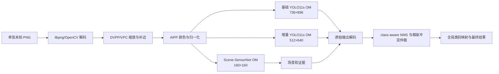
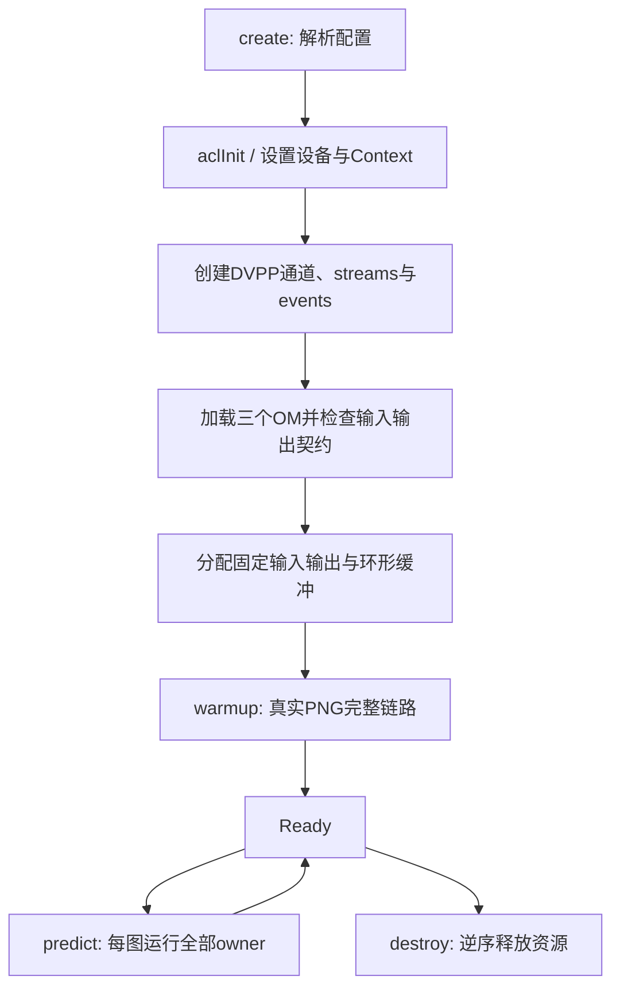

# AgileAgent Ascend 310B 到板部署、优化与验证指南

本文固定 AgileAgent 在 12 GB 内存、标称 20 TOPS 的 Ascend 310B 设备上的部署方案、精度边界和验收方法。板卡已经完成首次部署，因此本文同时保留可复用的分阶段运行手册，并以本页顶部的当前状态为准解释后续历史计划；`native_ascend/` 的 C++ contract stub 不是当前正式推理后端，当前可运行实现位于 `fair_agent/backends/ascend_acl.py`。

> 状态：三模型 OM、PyACL/AscendCL 后端、89图精度与真实 PNG 推理均已跑通；端到端30 FPS和1小时稳定性尚未通过
> 状态日期：2026-08-14
> 适用范围：当前 3+1 模拟增量模型，以及后续采用相同输入、标注和 Agent 协议重新训练的官方增量模型

当前正式 release 为 `/home/HwHiAiUser/agileagent/releases/212705a26d4414eff4e00604ce37c54d2ae729b2`，服务绑定 `127.0.0.1:8501`，本轮 SSH 只读复核时健康状态为 `ready`。正式配置保持 `encoded_preprocessing: cpu`，没有升级 CANN、驱动或固件，也没有切换正式 OM。仓库 `main` 已包含异步/AIPP 和默认关闭的 DVPP 候选代码；这些 staging 候选不等同于正式部署。原始板端日志尚未随仓库归档，因此 checkout 只能验证实现与配置，不能单独证明实时设备状态；精确边界见 [Ascend 310B 当前工程评估](ascend-310b-current-status.md)。

仓库级发布元数据尚未跟上板端事实：`configs/functional_models.yaml` 仍把三个功能模型的 `ascend_310b` 标为 `false`，所以 `python scripts/verify_release.py` 虽能通过资产一致性检查，输出仍包含 `ascend_310b_not_ready`。在正式 release 的 source/OM/config/报告清单及哈希归档完成前，应保留这一 fail-closed 状态，不能只凭服务可运行就把注册表改为 ready。

## 1. 结论

首选方案如下：

1. 三个模型分别导出为固定形状、`batch=1`、输出原始张量且不在图内执行 NMS 的 ONNX，再用 ATC 编译为 OM。当前已验证输入为基础 `736×896`、增量 `512×640`、场景 `160×160`。
2. 当前实现由 Python 编排 PyACL/AscendCL，在线推理不加载 PyTorch、ONNX Runtime、CUDA 或 TensorRT 模型；未来若迁移 C++，必须重新通过相同门禁。
3. 基础检测器、增量检测器和 Scene-SensorNet 全部常驻设备内存；任何未知输入图像都运行两个检测 owner，场景模型只提供软证据。
4. 正式 release 使用 CPU 解码/预处理；AIPP staging 候选已通过完整89图五项精度门禁，DVPP/VPC 仍只通过12图 preflight，默认关闭。
5. 仓库实现支持异步 stream 和固定缓冲；是否进入正式配置只能由完整精度、真实 multipart PNG API P95/FPS 与稳定性共同决定。
6. 首版使用混合 FP16。只有当原生 FP16 端到端性能仍不达标时，才进入受控 PTQ；不得为了峰值 TOPS 直接全模型 INT8。
7. 单图 `batch=1` 必须独立达到性能要求，不能依靠 `batch=20` 的吞吐掩盖单图延迟。

赛题最低目标是 30 FPS。本方案仍把内部工程目标固定为端到端平均吞吐不低于 36 FPS、P95 不高于 33.33 ms。当前 AIPP staging 的真实 multipart PNG API 为平均 `51.203 ms`、P95 `63.9 ms`、`19.53 FPS`；只有已解码 Agent 核心达到 `31.11 FPS`，不能据此宣称端到端达标。

## 2. 当前基线与风险边界

当前 production 每张图都执行三个模型：

| 模型 | 作用 | 输入 | PT 权重大小 | 当前精度证据 |
| --- | --- | --- | ---: | --- |
| YOLO11s 基础检测器 | 冻结旧类别 owner | `1×3×736×896` | 18.33 MiB | 正式 OM 基础 mAP50 `0.819407` |
| YOLO11s 增量检测器 | 新类别 owner | `1×3×512×640` | 18.28 MiB | 正式 OM New-mAP50 `0.728761` |
| Scene-SensorNet | IR/SAR 与已知场景软证据 | `1×3×160×160` | 0.75 MiB | 独立上下文模型，不能用于硬路由 |

正式 OM 的 KRR 为 `1.000000`，当前部署门禁还包括新类 precision `0.933333` 和70张旧类图上的误激活率 `0.014286`。这些结果来自当前750张图的固定模拟划分，不代表官方隐藏测试成绩。AIPP staging 候选对应结果为基础 mAP50 `0.819415`，其余四项相同；该候选没有切换正式 release。

正式板端结果相对门槛的余量分别为：基础 mAP50 约 `0.0194`、New-mAP50 约 `0.1288`。任何候选仍必须先通过五项门禁和无泄露检查，再比较真实性能；不能用平均指标余量容忍逐图检测数变化。

三个 PT 权重合计约 37.36 MiB，12 GB 内存足以容纳权重，但 PT 文件大小不能代表 OM 的真实内存占用。上线前必须用 `aclmdlQuerySize` 查询每个 OM 的权重与工作内存，并结合 `npu-smi` 记录三模型常驻、缓冲区和 DVPP 内存的峰值。

按当前固定矩形输入估算，三模型总计算量约为 51.9 GFLOPs/图，30 FPS 对应约 1.56 TOPS 的有效计算需求。相较方形 `896/640` 输入，两个检测分支的输入面积分别减少约17.9%和20%。该估算只用于判断方向可行，不是性能承诺；设备标称的20 TOPS通常对应特定精度和理想算子，不能直接等同于混合 FP16 的端到端吞吐。

## 3. 固定运行架构



### 3.1 模型执行语义

- 基础检测器和所有活动增量检测器必须处理每一张输入图像。
- 不允许先判断图像是“旧类图”还是“新类图”再选择模型。
- 不允许依据文件名、测试清单、标注、目录或图像 stem 路由。
- Scene-SensorNet 只提供软阈值证据，不能跳过任一检测器，也不能把未知场景直接解释为新类别。
- 基础 owner 继续负责全局类别 `0/1/3`，当前增量 owner 负责全局类别 `2`；后续官方新增类别只替换映射和模型资产，不改变运行模板。
- 框级融合必须复现当前 production profile 中冻结的激活阈值、类别映射、IoU 和冲突仲裁规则。

这组约束既是精度要求，也是防止评测作弊和数据泄露的部署要求。

### 3.2 进程与内存

首版采用单进程、单设备上下文：

- 启动时一次性加载三个 OM，不在请求间卸载。
- 每个模型拥有独立 model ID、stream、输入输出 dataset 和复用缓冲区。
- 使用 2 至 3 槽环形缓冲区重叠“解码/预处理、设备执行、后处理”。
- 通过 event 或 stream 同步只等待当前图像所需的结果，禁止在每一小步执行全设备同步。
- 模型、缓冲区或 DVPP 初始化失败时直接进入 Not Ready，不静默回退到 CPU。

## 4. 首次上板必须确认的硬件信息

“310B”包含多个产品与 SoC 变体，不能预先把 ATC 的 `--soc_version` 写死为 `Ascend310B4`。首次上板先保存以下输出：

```bash
npu-smi info
npu-smi info -m
atc --version
cat /usr/local/Ascend/ascend-toolkit/latest/version.cfg
uname -m
```

选择规则：

1. `--soc_version` 按目标设备报告的 `Name` 和当前 ATC 文档支持值确定。
2. 固件、驱动和 CANN 必须使用设备厂商支持的同一兼容矩阵。
3. OM 的转换环境可以与板端分离，但板端运行 CANN 不能旧于转换环境所要求的版本。
4. 不跨设备复用未经验证的 OM；ONNX 可以作为可移植中间资产，OM 在目标软件/硬件组合上重编译。

## 5. ONNX 与 OM 契约

### 5.1 固定形状

首版固定三个输入：

| 资产 | 输入形状 | Batch | 图内 NMS | 输出 |
| --- | --- | ---: | --- | --- |
| `base_detector.onnx/.om` | `1,3,736,896` | 1 | 禁用 | `1,7,13524` 原始 YOLO 输出 |
| `incremental_detector.onnx/.om` | `1,3,512,640` | 1 | 禁用 | `1,5,6720` 原始 YOLO 输出 |
| `scene_sensor_net.onnx/.om` | `1,3,160,160` | 1 | 不适用 | sensor logits、scene logits |

固定形状能减少动态 shape 管理、编译回退和运行期 workspace 波动。后续只有在官方输入规格确实要求多尺寸时，才新增独立 profile 或 OM；不要先引入动态 shape。

### 5.2 ATC 编译模板

实际输入名以导出的 ONNX 图为准。以下命令只展示固定参数结构：

```bash
SOC_VERSION="<npu-smi 与 ATC 文档确认的值>"

atc \
  --model=runs/ascend310b/onnx/rect/base_detector.onnx \
  --framework=5 \
  --output=runs/ascend310b/om/base_detector \
  --input_format=NCHW \
  --input_shape="images:1,3,736,896" \
  --soc_version="${SOC_VERSION}" \
  --precision_mode_v2=mixed_float16
```

增量模型改为 `1,3,512,640`，场景模型改为 `1,3,160,160`。精度参数按 CANN 版本二选一：

- 新版 CANN：`--precision_mode_v2=mixed_float16`
- 旧版 CANN：`--precision_mode=allow_fp32_to_fp16`

不能同时传入两个精度参数。编译日志中的不支持算子、Host 回退、精度降级和动态 shape 警告都必须清零或形成明确的验收记录。

ONNX、OM、编译日志和板端 profile 都属于设备侧可重建产物，放在 Git 已忽略的 `runs/` 下，不提交到仓库。模型身份以 Git 中的 production 权重、profile 和提交版本为准，不增加人工哈希核对步骤。

## 6. 预处理等价性

当前 750 张本地图像已核实为 PNG，尺寸全部是 `640×512`。板端预处理必须复现训练/评测链路的 RGB 顺序、插值、rounding 和 padding 值。

两个 YOLO 分支都应把解码结果转换为 RGB，按 NCHW 排列并缩放到 `[0,1]`；检测缩放使用与当前 OpenCV letterbox 一致的双线性插值。任何 BGR/RGB 互换、整数截断或重复归一化都会直接改变检测输出。

### 6.1 基础检测器

对 `640×512` 输入：

1. 等比例缩放到约 `896×717`。
2. 水平方向不补边。
3. 按 stride 32 的 `rect/auto` 规则垂直补到 `896×736`，padding 值为 `114`，上边9像素、下边10像素。

方形输入会产生89/90像素补边，但已验证固定方案不采用该形状。9/10来自 Ultralytics 对 stride 余数和奇数总 padding 的取整规则，不能简单改成两侧相同后裁切。

### 6.2 增量检测器

对 `640×512` 输入不缩放；宽高已经满足 stride 32，固定输入直接是 `640×512`，不再添加无效方形补边。

### 6.3 Scene-SensorNet

当前 PyTorch 评测变换为：

1. RGB 图像直接 resize 为 `176×176`。
2. 中心裁剪为 `160×160`。
3. 转为浮点张量。
4. 每通道使用 `mean=0.5`、`std=0.25` 归一化。

Scene-SensorNet 的 resize 是指定二维尺寸，不是保持原始宽高比的短边缩放。

### 6.4 DVPP/VPC 与 AIPP 分工

- VPC：缩放、letterbox、裁剪和 padding。
- AIPP：颜色空间转换、通道排列、数值缩放和归一化。
- PNG：先确认该型号与 CANN 版本的硬件解码支持；若不支持，固定使用 libpng/OpenCV 软件解码，随后把解码结果交给 VPC。

实现完成后，至少抽取不同传感器、场景和目标尺度的真实训练图，对比 PyTorch 与板端预处理张量、还原框坐标和最终预测。小目标对插值与半像素差异敏感，不能只看肉眼图像是否相似。

## 7. 调度与性能预算

### 7.1 固定验收目标

| 指标 | 要求 |
| --- | ---: |
| 输入模式 | 单图、`batch=1` |
| 端到端平均吞吐 | `≥36 FPS` |
| 端到端 P95 | `≤33.33 ms` |
| 官方最低吞吐 | `≥30 FPS` |
| 连续稳定性 | 1 小时无错误、无持续降频、无内存增长 |

当前通用配置中的 `target_p95_ms: 50` 是 x86/API 基线，不作为 310B 板端验收线。实现 Ascend profile 时应单独固定上述更严格门槛。

端到端计时必须包含：真实 PNG 读取与解码、三路预处理、Host/Device 必要传输、三个 OM、YOLO 解码、NMS、软场景融合和结果序列化。只报告 OM 内核耗时或批量吞吐不算通过。

### 7.2 调度候选

按同一批真实图像依次测量：

1. 三模型串行。
2. 基础与增量检测器并发，场景模型串行。
3. 三模型完全并发。

Ascend 的并发收益受 AI Core、内存带宽、DVPP 和 stream 调度影响，CUDA 上的 `parallel_model_execution: true` 不能直接照搬为板端最优结论。选择规则是：在精度完全一致的前提下，以端到端 P95 为第一排序项，以平均 FPS 和温度稳定性为第二排序项，冻结最优方式。

### 7.3 预热

- 加载完成后用真实训练图执行完整链路预热，至少 20 次。
- 预热必须覆盖解码、三种预处理、三个 OM 和后处理，不能只空跑模型。
- 最近一段延迟变异稳定后才把服务状态切为 Ready。
- 新增 OM 上线时先 shadow-load、预热并自检，再原子切换；失败立即保留上一代。

## 8. 精度与量化策略

### 8.1 第一阶段：混合 FP16

先完成固定形状混合 FP16 的端到端迁移。它必须满足：

- 基础 mAP50 `≥0.80`
- New-mAP50 `≥0.60`
- KRR `≥0.95`
- 新类 precision `≥0.90`
- 70 张旧类图上的新类误激活率 `≤0.05`

建议同时记录相对 PyTorch 基线的总体 mAP50 差值与逐类 AP 差值；任何指标即使只下降少量，只要跨过上述硬门槛就必须拒绝上线。

历史板前阶段曾使用 ONNX Runtime CUDA 代理验证，它只回答“当前权重和 Agent 对 FP16 是否敏感”，不能代替 ATC `mixed_float16` 的算子选精度和 OM 性能。该实验仍可按以下命令复现：

```bash
python tools/90_ascend_preflight.py convert-fp16 \
  --source-root runs/ascend310b \
  --output-root runs/ascend310b_mixed_fp16 \
  --shape-mode rect --overwrite
python tools/90_ascend_preflight.py metric-align \
  --output-root runs/ascend310b_mixed_fp16 \
  --shape-mode rect --device 0 --provider cuda
python tools/90_ascend_preflight.py optimize \
  --output-root runs/ascend310b_mixed_fp16 \
  --shape-mode rect --device 0 --provider cuda --warmup 30 --rounds 100
```

该转换把内部权重与主要计算转为 FP16，同时保持输入输出 FP32、固定 Batch=1、固定 shape 和图外 NMS。两个检测 ONNX 分别由约 `38.03/37.89 MB` 降至 `19.07/19.00 MB`，Scene-SensorNet 由 `0.77 MB` 降至 `0.39 MB`。2026-08-08 的完整89张冻结评测结果为：

| 本机混合 FP16 代理指标 | 结果 | 门槛 | 判定 |
| --- | ---: | ---: | --- |
| 基础 mAP50 | `0.81954` | `≥0.80` | 通过 |
| New-mAP50 | `0.63869` | `≥0.60` | 通过 |
| KRR | `1.00000` | `≥0.95` | 通过 |
| 新类 precision | `0.92453` | `≥0.90` | 通过 |
| 老图误激活率 | `0.01429` | `≤0.05` | 通过 |

五项硬门槛全部通过；相对同次 PyTorch FP32 的最大指标绝对差为 `0.00544`，来自基础 mAP50 的小幅上浮，因此没有通过工具中更严格的“近似逐指标等价”阈值。原始张量余弦相似度最低值分别为基础检测器 `0.99999897`、增量检测器 `0.99999877`、Scene-SensorNet `0.99953009`；Scene 对 FP16 更敏感，但当前门禁未改变。另测“两个检测器 FP16、Scene 保持 FP32”，五项指标与全 FP16 方案相同。

性能方面，本机 CUDA 代理没有得到可重复的 FP16 优势。完全保持89张最终输出一致的候选，全 FP16 为平均 `37.081 ms` / P95 `51.085 ms` / `26.97 FPS`，Scene 保持 FP32 为 `36.640 ms` / `50.145 ms` / `27.29 FPS`，同配置 FP32 为 `36.191 ms` / `49.286 ms` / `27.63 FPS`。FP16 的最快候选虽达到平均 `31.439 ms`，却因冻结的新增类早筛阈值出现 `1/89` 张最终检测差异，必须拒绝，且不得根据测试集重新调阈值。

这段板前实验最终只用于选择到板候选。目标板已经以 ATC `mixed_float16` 编译并验证正式 OM；后续 AIPP/ATC/DVPP 候选仍必须由真实310B的完整89张精度和端到端 P95 决定，不能根据本机 CUDA 结果预判或覆盖板端记录。

### 8.2 第二阶段：受控 PTQ，仅在性能不足时启用

若 FP16 原生链路仍无法达到性能目标，使用 msModelSlim 对 ONNX 做真实样本 PTQ：

- CNN 权重采用 signed INT8、per-channel。
- 基础检测器校准只读取 `splits/strict_3plus1/base_train.txt`。
- 增量检测器校准只读取 `splits/strict_3plus1/increment_train.txt`。
- Scene-SensorNet 校准只读取 `splits/strict_3plus1/scene_train.txt`。
- 新类部署阈值只允许用 `splits/strict_3plus1/increment_dev.txt` 重新校准。
- 禁止用 `splits/strict_3plus1/base_test.txt`、`splits/strict_3plus1/mixed_test.txt`、lock 标签或官方测试数据做校准、选层或调阈值。

量化顺序：

1. 先量化卷积 backbone。
2. Detect head、DFL/Softmax、Sigmoid 和最终输出层优先保留 FP16。
3. 每扩大一次 INT8 范围，都重新执行完整精度、误激活和性能验收。
4. 任何候选不通过就回退到上一组混合精度配置，不继续扩大范围。

不采用“一次性全 INT8”或只看单模型 cosine similarity 的上线方式。

## 9. 评测合规与无泄露验收

板端评测必须保持仓库当前的无标签语义：

1. 先冻结 OM、阈值、预处理和融合规则。
2. 基础与增量 owner 对 `splits/strict_3plus1/mixed_test.txt` 中完整 89 张图执行同一条无标签链路。
3. 推理完成并保存全部原始与融合预测后，评分器才能读取 `splits/strict_3plus1/base_test.txt` 和测试标签。
4. 基础 mAP50 只在 70 张纯旧类图像上计分。
5. New-mAP50 与 KRR 在完整 89 张旧类加新类混合集上计算。
6. 对比输入 stem 集合，确认两个检测 owner 都等于完整 `splits/strict_3plus1/mixed_test.txt`。
7. 检查日志，确认没有文件名路由、标签路由或场景硬路由。

后续官方增量数据到达时，只替换新增类别映射、训练清单、增量权重和由增量 train/dev 得到的软先验与阈值；上述推理和验收语义保持不变。

## 10. 板端验收流程

### 阶段 A：单模型正确性

- 导出并检查三个固定形状 ONNX。
- 分别编译三个 OM，记录 ATC 与 SoC 信息。
- 使用相同输入保存 PyTorch、ONNX 和 OM 原始输出。
- 对齐预处理张量、logits、YOLO 解码和还原框坐标。

### 阶段 B：单模型性能

- 用 `msit benchmark` 测每个 OM 的纯执行平均值、P50、P95 和吞吐。
- 查询 `aclmdlQuerySize`，记录模型内存与工作内存。
- 记录设备利用率、温度、功耗和频率。

`msit benchmark` 只用于定位单模型，不替代完整 Agent 验收。

### 阶段 C：完整 Agent

- 接入原生 AscendCL 后端。
- 跑串行、双路并发和三路并发矩阵。
- 在完整测试协议上重算五项精度/质量门禁。
- 用真实 PNG、`batch=1` 测量端到端平均值、P50、P95、P99 和 FPS。

### 阶段 D：稳定性

- 完整链路预热至少 20 次。
- 连续运行 1 小时。
- 记录解码、预处理、传输、各 OM、NMS/融合和序列化的分段耗时。
- 记录峰值内存、温度、频率与是否出现热降频。
- 验证模型热切换失败时能原子回滚，且不存在静默 CPU fallback。

阶段 A 至 D 已通过，因此当前状态是“板端推理可用且精度门禁通过”；阶段 G5 尚未通过，所以不能写成“端到端性能验收通过”。

## 11. 性能仍不达标时的结构级备选

如果两个 YOLO OM 即使经过原生 AscendCL、固定 shape 和受控混合精度仍不能达到 30 FPS，优先考虑共享主干，而不是继续牺牲精度：

1. 冻结基础 YOLO 的 backbone、neck 和旧类 head。
2. 只使用增量数据训练轻量 adapter/新增类 head。
3. 单次计算共享 P3/P4/P5 特征，再分别执行旧类 head 和新增类 head。

这能去掉一次完整 YOLO backbone/neck，是计算量降幅最大的备选，同时结构上保留旧类分支。但它需要重新训练，且必须重新通过基础 mAP50、New-mAP50、KRR、precision、误激活率和无泄露验收，不能作为不经验证的部署替换。

## 12. 预期代码与资产边界

仓库已经新增独立 Ascend 契约目录，没有把现有 TensorRT/CUDA `native/` 代码改造成条件分支堆叠：

310B 构建不得链接 TensorRT、CUDA 或加载 `.engine`；模型产物只能是 ATC 从已验收 ONNX 编译得到的 OM，运行时只能通过 CANN/AscendCL 和对应媒体处理接口执行。

```text
native_ascend/
├── CMakeLists.txt
├── include/              # 已冻结的整体管线 C ABI
└── src/                  # C++ contract stub；当前真实 PyACL 后端位于 fair_agent/backends/ascend_acl.py

runs/ascend310b/
├── onnx/                 # 可重建，不入 Git
├── om/                   # 设备相关，不入 Git
├── compile_logs/         # 本地诊断
└── benchmarks/           # 板端验收报告
```

仓库提交：后端契约源码、导出/对齐/性能工具、自动化测试和不含竞赛数据的验收说明。仓库不提交：OM、ONNX、golden真实图片、设备日志、标签、运行缓存或 CANN 安装包。

## 13. 板前 WSL 验证结果

使用 WSL Ubuntu 20.04、RTX 4060 Laptop、PyTorch 2.5.1、Ultralytics 8.4.92、ONNX 1.17 和 ONNX Runtime 1.23.2 CUDA Provider，已完成：

```bash
python tools/90_ascend_preflight.py export --shape-mode rect --device 0
python tools/90_ascend_preflight.py raw-align --shape-mode rect --device 0 --samples 6
python tools/90_ascend_preflight.py metric-align --shape-mode rect --device 0
python tools/90_ascend_preflight.py golden --shape-mode rect --device 0 --samples 6
python tools/90_ascend_preflight.py benchmark --shape-mode rect --device 0 \
  --samples 6 --warmup 20 --rounds 100
python tools/90_ascend_preflight.py optimize --shape-mode rect --device 0 \
  --samples 6 --warmup 20 --rounds 100
```

三个 ONNX 均为固定 Batch=1、无动态维度、无图内 NMS。dev 样本覆盖基础类与新增类；原始输出归一化最大误差小于 `10⁻³`。完整89张混合集在所有 owner 无标签推理并冻结融合结果后才读取标签，结果如下：

| 指标 | 同形状 PyTorch | ONNX Runtime CUDA | ONNX-PyTorch 差值 |
| --- | ---: | ---: | ---: |
| 基础 mAP50 | `0.814118` | `0.814197` | `+0.000079` |
| New-mAP50 | `0.638688` | `0.638688` | `0` |
| KRR | `1.000000` | `1.000000` | `0` |
| 新类 precision | `0.924528` | `0.924528` | `0` |
| 旧类图误激活率 | `0.014286` | `0.014286` | `0` |

最大指标绝对差为 `9.8×10⁻⁵`，五项门禁全部通过。golden bundle 位于 `runs/ascend310b/golden/rect/`，包含3张无标签代表图、三路输入张量和 ONNX 原始输出，供板端逐元素对齐；该目录被 Git 忽略。

RTX 4060 的 ONNX Runtime CUDA 代理性能仅用于验证计时框架，不能代表310B。更新后的标准调度基准已包含类别映射、NMS、框级融合和场景软门控：

| 调度 | 平均总延迟 | P95 | 按平均值折算 FPS |
| --- | ---: | ---: | ---: |
| 串行 | `43.795 ms` | `57.448 ms` | `22.83` |
| 两检测器并行 | `45.123 ms` | `57.634 ms` | `22.16` |
| 三模型并行 | `45.713 ms` | `58.168 ms` | `21.88` |

本次100轮中串行 P95 最低，并行没有收益。这只说明调度必须在目标设备上实测，不能把 CUDA、线程池或“多 stream 必然更快”写成固定结论。

在相同6张轮换性能样本上进一步测试了板端可迁移优化候选；每轮所有候选处理同一张图，并用完整89张混合集另做无标签正确性检查：

| CUDA 代理候选 | 平均总延迟 | P95 | 按平均值折算 FPS | 决策 |
| --- | ---: | ---: | ---: | --- |
| Pillow + 普通 ORT 参考 | `40.985 ms` | `53.065 ms` | `24.40` | 参考 |
| OpenCV PNG 解码 | `37.573 ms` | `50.477 ms` | `26.61` | 保留 |
| OpenCV + 固定地址 CUDA Graph 串行 | `36.769 ms` | `50.055 ms` | `27.20` | 保留为固定缓冲代理证据 |
| 再加 NMS 候选预筛选 | `35.948 ms` | `48.917 ms` | `27.82` | 保留 |
| 再加新增类最低阈值前移 | `30.337 ms` | `31.918 ms` | `32.96` | 本机稳定候选 |
| 再并行 Python 预处理 | `29.477 ms` | `35.709 ms` | `33.92` | P95 恶化，拒绝 |
| 再并行 Python 后处理 | `32.167 ms` | `33.819 ms` | `31.09` | 平均值与 P95 均恶化，拒绝 |

稳定候选的平均分段为预处理 `12.773 ms`、三模型 `14.820 ms`、完整后处理 `2.744 ms`。它在本机代理上超过平均30 FPS且 P95 低于33.33 ms，但还没有达到内部 `≥36 FPS` 余量目标。

正确性检查不读取标签，基础、增量和场景三个 owner 均处理全部89张图。Pillow/OpenCV 输入最大差、普通 ORT/CUDA Graph 原始输出最大差均为 `0`；候选预筛选、新增类门禁前移和最终检测的不一致图像数均为 `0`。最低阈值前移只把当前 profile 的新增类激活下限 `0.63` 提前到 NMS 前，场景软门控仍可把最终阈值提高最多 `0.05`；它不会跳过 owner、不会依据图像类别路由，也不能单独激活新增类。

ONNX Runtime 的 CUDA Graph 会话在本机默认流上不能安全地并发捕获。代理实现因此先串行完成固定地址分配和两次预热/捕获，再以串行图执行参与基准；这不是 AscendCL 的实现约束。310B 仍需分别实测 ACL 串行、双 stream 和三 stream，并以端到端 P95 冻结调度。

上述历史 CUDA 优化只存在于 `tools/90_ascend_preflight.py` 的板前基准路径。仓库现已实现 PyACL 异步/AIPP 与可选 DVPP 路径，但正式 production 未切换 staging 候选；ORT CUDA Graph 结果仍不可写成板端证据。

原生 C ABI contract stub 也已在 WSL 用 GCC 9.4/CMake 3.16 构建并通过 smoke：ABI版本1、Ready=false、warmup/predict明确失败、无CPU回退。当前 production 使用独立 PyACL 实现；只有未来 C++ 迁移才必须保持该 ABI。

## 14. 官方参考资料

- [ATC `--soc_version` 参数](https://www.hiascend.com/document/detail/zh/CANNCommunityEdition/latest/devaids/atctool/atlasatcparam_16_0036.html)
- [ATC `--input_shape` 参数](https://www.hiascend.com/document/detail/zh/CANNCommunityEdition/latest/devaids/atctool/atlasatcparam_16_0016.html)
- [ATC 精度模式](https://www.hiascend.com/document/detail/zh/CANNCommunityEdition/latest/devaids/atctool/atlasatcparam_16_0069.html)
- [AscendCL 异步执行约束](https://www.hiascend.com/document/detail/zh/canncommercial/800/apiref/appdevgapi/aclcppdevg_03_0299.html)
- [DVPP/VPC 组合预处理](https://www.hiascend.com/document/detail/en/CANNCommunityEdition/900/programug/acldevg/aclcppdevg_000080.html)
- [msModelSlim](https://github.com/Ascend/msmodelslim)
- [msIT benchmark](https://github.com/Ascend/msit/blob/master/msit/docs/benchmark/README.md)

## 15. 实施前检查单

下列 `[x]` 同时包含仓库可复核项和本轮板端只读观测；涉及 NPU、OM、温度、精度或服务状态的勾选不能由 checkout 单独证明，交付时必须由同一 release manifest 和原始报告重新签字。

- [x] 已取得硬件/软件识别输出：Atlas 200I DK A2 / Ascend310B1，NPU 健康状态为 OK。
- [x] 已冻结现有固件、驱动和 CANN 7.0.RC1；本轮未升级或混装。
- [x] 三个 ONNX 均为固定 shape、batch=1、原始输出且无图内 NMS。
- [x] 本机混合 FP16 ONNX 代理五项门禁通过；未将 CUDA 代理误写为板端证据。
- [x] 三个 mixed-float16 OM 已在目标板编译并可由 PyACL 加载执行。
- [x] 本机参考预处理、PyTorch 与 ONNX Runtime 原始输出已对齐。
- [x] 本机89张无标签逐层优化等价性检查通过。
- [x] 本机CUDA代理已筛出平均 `32.96 FPS`、P95 `31.918 ms` 的稳定候选；不作为310B证据。
- [ ] DVPP/VPC 仅完成12图 preflight；AIPP 候选完成89图五项门禁，但两者均未切换正式 release。
- [x] 正式服务三个 OM 常驻且健康；空闲观测 NPU 内存为 `6905 / 11577 MB`、温度 `63°C`。
- [x] 已完成同步/异步与 AIPP 组合候选测试；正式 release 仍保持原配置。
- [ ] 完整 Agent 达到 `≥36 FPS` 且 P95 `≤33.33 ms`。
- [x] PyTorch/ONNX 五项精度与部署质量门禁全部通过。
- [x] 板前无标签全量推理和无泄露审计通过。
- [x] OM 完整 Agent 的五项门禁与无泄露审计通过。
- [ ] 1 小时稳定性、温度和回滚测试通过。

---

## 16. 到板运行手册的使用规则

后续章节使用三种状态标记，执行时必须先看标记：

- **【仓库已实现】**：命令或接口目前存在，可直接从仓库根目录运行。
- **【板端命令模板】**：命令结构有效，但 CANN 版本、安装路径、SoC 名称或工具参数必须以目标板实际输出为准。
- **【待实现】**：仍未实现的可选 C++ ABI、稳定性或优化项；不得把 stub 的构建成功写成 Ascend 推理成功，也不得把 staging 候选写成正式 release。

整个到板过程分为六个门，必须按顺序通过：

| 门 | 目标 | 允许进入下一门的条件 |
| --- | --- | --- |
| G0 硬件与环境 | 确认设备、驱动、固件、CANN 和散热稳定 | NPU 可见、无健康告警、软件版本兼容 |
| G1 模型转换 | 三个固定 ONNX 成功转换为目标 SoC 的 OM | shape、输出、算子与编译日志可解释 |
| G2 单模型对齐 | 相同输入下 ONNX 与 OM 原始输出可对齐 | 三个模型的输出数量、shape、数值趋势正确 |
| G3 Agent 对齐 | PNG 到最终检测的整条链路正确 | golden 逐层通过，所有 owner 每图执行 |
| G4 精度与合规 | 完整混合集无标签推理后评分 | 五项质量门槛和无泄露检查全部通过 |
| G5 性能与稳定性 | 达到单图实时性并可长期运行 | 平均 `≥36 FPS`、P95 `≤33.33 ms`、1小时稳定 |

如果 G1 至 G4 任一失败，先修正确性，不能通过加大阈值、删模型、按图片路由或缩小测试集来换速度。只有 G4 通过后才能冻结一个性能候选。

## 17. 建议的板端目录和资产边界

以下路径只是模板。若板子的系统盘空间较小，把 `AGILE_ROOT` 放在数据盘，不要放在只读系统分区：

```bash
export AGILE_ROOT=/data/agileagent
export AGILE_REPO="$AGILE_ROOT/app/AgileAgent"
export AGILE_ASSETS="$AGILE_ROOT/assets"
export AGILE_RUNS="$AGILE_ROOT/runs"
export AGILE_LOGS="$AGILE_ROOT/logs"

mkdir -p "$AGILE_ROOT/app" "$AGILE_ASSETS" "$AGILE_RUNS" "$AGILE_LOGS"
```

推荐目录如下：

```text
/data/agileagent/
├── app/
│   └── AgileAgent/                 # 唯一 Git 工作树
├── assets/
│   ├── onnx/rect/                  # 板前验收过的固定 ONNX
│   ├── golden/rect/                # 无标签 golden 输入与参考输出
│   └── om/<soc>/<cann>/<candidate>/# 目标设备可重建 OM
├── eval/
│   ├── images/                     # 评测进程可读
│   └── labels/                     # 仅评分进程可读
├── runs/                            # 预测、profile、benchmark、soak 记录
└── logs/                            # 服务与 CANN 日志
```

必须遵守以下边界：

- 代码只保留一个 Git 工作树，不复制出多个 `AgileAgent_*` 目录。
- ONNX、OM、golden 真图、数据集、板端日志和 benchmark 结果都不提交 Git。
- Git 中的 `models/production/incremental_detection/profile.json`、配置和代码是运行语义来源；OM 是由它们派生的设备资产。
- 测试标签与推理进程物理或权限隔离。ATC、AIPP、PTQ、阈值校准和调度选择都不能读取测试标签。
- 不安装或调用 TensorRT、CUDA 原生后端，也不生成、复制或加载 `.engine`。

## 18. G0：到货当天的硬件验收

### 18.1 先确认产品形态

先确定这是带系统的边缘设备、开发套件，还是安装到宿主机的 PCIe 推理卡。三种形态的驱动安装位置、电源和网络不同，但后续 OM/ACL 契约相同。包装、板卡丝印和管理工具输出至少记录：

- 完整产品型号与 SoC 名称；
- 标称 12 GB 内存是否与 `npu-smi` 可见容量一致；
- 序列号、固件版本、驱动版本；
- 电源规格、风扇/散热器状态；
- 宿主 CPU 架构与操作系统版本。

### 18.2 保存只读环境快照

**【板端命令模板】** 在板端或 PCIe 卡宿主机执行，并把输出保存在同一次验收目录：

```bash
export ACCEPTANCE_DIR="$AGILE_RUNS/board_acceptance/$(date +%Y%m%d-%H%M%S)"
mkdir -p "$ACCEPTANCE_DIR"

date -Ins | tee "$ACCEPTANCE_DIR/time.txt"
cat /etc/os-release | tee "$ACCEPTANCE_DIR/os-release.txt"
uname -a | tee "$ACCEPTANCE_DIR/uname.txt"
uname -m | tee "$ACCEPTANCE_DIR/architecture.txt"
lscpu | tee "$ACCEPTANCE_DIR/lscpu.txt"
free -h | tee "$ACCEPTANCE_DIR/memory.txt"
df -h | tee "$ACCEPTANCE_DIR/disk.txt"
npu-smi info | tee "$ACCEPTANCE_DIR/npu-smi-info.txt"
```

若该版本支持，再单独执行并保存 `npu-smi info -m`；若不支持，不要把参数错误解释为设备故障。`npu-smi info` 至少需要确认：设备数量正确、Health 正常、无 ECC/驱动告警、内存容量符合采购规格、温度和功耗读数合理。

### 18.3 空闲稳定性检查

在加载模型前连续观察 10 至 15 分钟：

```bash
watch -n 1 npu-smi info
```

通过条件：设备不反复掉线，空闲温度不持续上升，内存占用稳定，没有驱动复位或健康状态变化。若此阶段不稳定，先处理供电、散热、固件或驱动，不能继续做模型问题定位。

## 19. G0：驱动、固件与 CANN 环境

### 19.1 版本原则

驱动、固件、Toolkit 和 Runtime 必须来自设备厂商支持的同一兼容矩阵。不要因为另一台 310B 能运行，就复制其 OM 或混装其 CANN。建议冻结一张环境表：

| 项目 | 实际值 | 来源 |
| --- | --- | --- |
| 产品/SoC | 待填 | `npu-smi info` 与产品资料 |
| OS/架构 | 待填 | `/etc/os-release`、`uname -m` |
| 固件 | 待填 | 设备管理工具 |
| 驱动 | 待填 | `npu-smi info` |
| CANN Toolkit | 待填 | `atc --version`、`version.cfg` |
| CANN Runtime | 待填 | 板端安装信息 |
| 编译器/CMake | 待填 | `g++ --version`、`cmake --version` |

OM 可以在独立转换机上编译，但转换机的 Toolkit 必须与板端 Runtime 兼容。若板端只有 Runtime，没有 ATC，就在兼容的 x86/aarch64 转换环境生成 OM，再传到板端。

### 19.2 激活环境

**【板端命令模板】** CANN 安装布局因镜像而异，先检查实际存在的脚本，只 source 一个正确入口：

```bash
export ASCEND_HOME=/usr/local/Ascend/ascend-toolkit/latest
source "$ASCEND_HOME/set_env.sh"

which atc
atc --version
cmake --version
g++ --version
python3 --version
```

如果不存在上述路径，常见替代位置是 `/usr/local/Ascend/ascend-toolkit/set_env.sh` 或 Runtime 的 `set_env.sh`。必须以已安装版本为准，不要通过创建伪造的 `latest` 软链接掩盖版本差异。

### 19.3 确定 `soc_version`

1. 保存 `npu-smi info` 报告的芯片/产品名称。
2. 执行 `atc --help`，并查当前 CANN 版本的 `--soc_version` 官方表。
3. 把确认后的值写入本次转换记录，例如 `SOC_VERSION=<已确认值>`。
4. 不允许仅凭“310B”三个字符猜成 `Ascend310B1`、`Ascend310B4` 或其他变体。

如果 ATC 报 SoC 不支持，应先解决 Toolkit/SoC 组合，不要删除 `--soc_version` 或用其他芯片名称强行生成 OM。

## 20. G1：准备并复核固定 ONNX

### 20.1 在有完整 Python 环境的机器生成

**【仓库已实现】** 从仓库根目录执行：

```bash
python tools/90_ascend_preflight.py export \
  --output-root runs/ascend310b \
  --shape-mode rect \
  --device 0 \
  --opset 17

python tools/90_ascend_preflight.py raw-align \
  --output-root runs/ascend310b \
  --shape-mode rect \
  --device 0 \
  --provider cuda \
  --samples 6

python tools/90_ascend_preflight.py metric-align \
  --output-root runs/ascend310b \
  --shape-mode rect \
  --device 0 \
  --provider cuda

python tools/90_ascend_preflight.py golden \
  --output-root runs/ascend310b \
  --shape-mode rect \
  --device 0 \
  --provider cuda \
  --samples 6
```

若目标机没有 CUDA，需同时使用 `--device cpu --provider cpu` 做 ONNX 契约和数值检查；这只会更慢，不改变契约。`metric-align` 已经实现“两个检测 owner 先对完整混合集无标签推理并落盘，随后才打开标签”的评分顺序。重复执行时优先使用新的 `--output-root` 保留上一轮证据；只有明确要重建同一目录时才加 `--overwrite`。

### 20.2 ONNX 必须满足的契约

`runs/ascend310b/onnx/rect/manifest.json` 中应出现：

| 模型 | 输入名 | 输入 shape | 输出 shape |
| --- | --- | --- | --- |
| Base | `images` | `1,3,736,896` | `1,7,13524` |
| Incremental | `images` | `1,3,512,640` | `1,5,6720` |
| Scene | `images` | `1,3,160,160` | 两个固定 logits 输出 |

同时必须满足：固定 `batch=1`、无动态维度、无 `NonMaxSuppression` 节点、FP32 输入输出、图外 NMS。若重新训练导致类别数或输出 shape 改变，先更新并重跑 ONNX 契约，不能沿用旧 OM 的输出解析。

### 20.3 传输到转换机/板端

推荐通过 Git 获取代码，再只复制忽略目录中的中间资产：

```bash
git clone <AgileAgent远程仓库地址> "$AGILE_REPO"
cd "$AGILE_REPO"

mkdir -p "$AGILE_ASSETS/onnx" "$AGILE_ASSETS/golden"
# 从板前机器复制 runs/ascend310b/onnx/rect/ 到 assets/onnx/rect/
# 从板前机器复制 runs/ascend310b/golden/rect/ 到 assets/golden/rect/
```

传输后以 ONNX `manifest.json` 和 Git 提交号确认来源即可。不要把测试标签与 ONNX/ATC 校准资产打包在一起。

## 21. G1：使用 ATC 编译三个 OM

### 21.1 首选混合 FP16 候选

**【板端命令模板】** 以下示例假设输入名为 `images`，并且当前 CANN 支持 `--precision_mode_v2`：

```bash
export SOC_VERSION=<通过npu-smi和ATC文档确认的值>
export ONNX_DIR="$AGILE_ASSETS/onnx/rect"
export OM_DIR="$AGILE_ASSETS/om/$SOC_VERSION/mixed_float16"
export ATC_LOG_DIR="$AGILE_LOGS/atc/$SOC_VERSION/mixed_float16"
mkdir -p "$OM_DIR" "$ATC_LOG_DIR"

atc \
  --model="$ONNX_DIR/base_detector.onnx" \
  --framework=5 \
  --output="$OM_DIR/base_detector" \
  --input_format=NCHW \
  --input_shape="images:1,3,736,896" \
  --soc_version="$SOC_VERSION" \
  --precision_mode_v2=mixed_float16 \
  2>&1 | tee "$ATC_LOG_DIR/base_detector.log"

atc \
  --model="$ONNX_DIR/incremental_detector.onnx" \
  --framework=5 \
  --output="$OM_DIR/incremental_detector" \
  --input_format=NCHW \
  --input_shape="images:1,3,512,640" \
  --soc_version="$SOC_VERSION" \
  --precision_mode_v2=mixed_float16 \
  2>&1 | tee "$ATC_LOG_DIR/incremental_detector.log"

atc \
  --model="$ONNX_DIR/scene_sensor_net.onnx" \
  --framework=5 \
  --output="$OM_DIR/scene_sensor_net" \
  --input_format=NCHW \
  --input_shape="images:1,3,160,160" \
  --soc_version="$SOC_VERSION" \
  --precision_mode_v2=mixed_float16 \
  2>&1 | tee "$ATC_LOG_DIR/scene_sensor_net.log"
```

旧版 CANN 若只支持 `--precision_mode=allow_fp32_to_fp16`，用该参数替换 `--precision_mode_v2`，不能同时传两个精度参数。若 Scene 对齐失败，优先单独生成 Scene 的保守精度 OM；具体“保持原始精度”参数和算子精度配置文件语法必须以当前 `atc --help` 与官方文档为准，不能从其他 CANN 版本照抄。

### 21.2 编译日志验收

每个 OM 必须同时满足：

- ATC 返回码为 0，`.om` 文件非空；
- 输入名和固定 shape 与 ONNX manifest 一致；
- 没有未解决的 unsupported op；
- 没有未知 Host fallback、动态 shape 或精度降级；
- 所有 warning 都被逐条解释，不能只因为生成了 OM 就视为通过；
- OM、ATC 版本、SoC 值和完整命令被写入同一候选目录。

失败处理顺序：先核对 ONNX 契约和 CANN/SoC，再定位具体算子，最后才考虑修改导出图。不要一开始就改模型结构或开启全 INT8。

## 22. G2：单模型 OM 冒烟与原始输出对齐

### 22.1 用 msIT 先隔离模型问题

**【板端命令模板】** 先执行 `msit benchmark --help` 确认当前版本参数，再对三个 OM 分别运行。典型结构如下：

```bash
msit benchmark \
  --model "$OM_DIR/base_detector.om" \
  --input "$AGILE_ASSETS/golden/rect/<case>/base_detector_input.npy" \
  --device 0 \
  --warmup_count 20 \
  --loop 100 \
  --output "$AGILE_RUNS/msit/base"
```

对增量和 Scene 模型替换 OM 与 `.npy` 输入。部分 msIT 版本要求原始 `.bin` 而不是 `.npy`；应根据 `--help` 做无数值变化的格式转换，不得重新做 resize/归一化。msIT 只证明单个 OM 能运行和给出纯模型耗时，不证明 Agent 正确或达到 30 FPS。

### 22.2 对齐顺序

每个 golden case 按以下层级检查：

1. OM 输入元素数量、dtype 和 shape 与 `.npy` 完全一致。
2. 输出数量和 shape 与 ONNX manifest 完全一致。
3. 将 OM 原始输出转成 `.npy`，与 golden ONNX 输出比较。
4. 使用仓库相同的 YOLO 解码和 Scene softmax，检查候选框、类别和 logits 排序。

仓库板前 `raw-align` 使用的诊断目标是：归一化最大绝对误差 `≤1e-3`、相对 L2 `≤1e-3`、余弦相似度 `≥0.99999`。OM 混合 FP16 如果未达到该诊断线，不能直接判死，但必须继续定位到具体模型/输出，并通过完整 89 张指标决定是否可接受；任何跨过五项硬门槛的变化都必须拒绝。

## 23. G3：实现真实 AscendCL 后端

### 23.1 当前状态

真实板端后端已经实现于 `fair_agent/backends/ascend_acl.py`：它通过 PyACL/AscendCL 初始化设备、校验并加载三个 OM、复用输入输出缓冲、执行 YOLO/Scene 后处理，并在 OM、哈希、shape 或运行时契约不符时直接失败。`tools/92_run_ascend_om.py` 提供单模型/原始输出执行入口，`tools/94_score_ascend_agent.py` 提供冻结预测后的板端评分入口。正式服务健康状态为 `ready`，每张图都执行 Base、Incremental 和 Scene，且无 CPU/CUDA/PyTorch 模型推理回退。

`native_ascend/` 目录本身仍只构建 `libagile_agent_ascend_contract_stub.so`。它会固定返回 Not Ready，用于证明可选 C++ ABI、错误传播和禁止 CPU fallback；它不会加载 OM、调用 CANN 或给出 FPS。两条路径不能混写：当前 production 是 PyACL，C++ 目录是回归夹具和未来迁移边界。

**【仓库已实现】** 可用下列命令确认 stub 契约没有被破坏：

```bash
cmake -S native_ascend -B build/native_ascend_stub -DCMAKE_BUILD_TYPE=Release
cmake --build build/native_ascend_stub --config Release -j
python tools/91_smoke_ascend_contract.py \
  build/native_ascend_stub/libagile_agent_ascend_contract_stub.so
```

**【可选待实现】** 若后续需要从 PyACL 迁移到 C++，应在保持 `native_ascend/include/agile_agent_ascend_backend.h` ABI v1 不变的前提下新增真实共享库目标。它不是当前推理可用性的阻塞项，但迁移候选必须重新通过89图精度、API 性能和稳定性门禁。

### 23.2 生命周期契约

当前 PyACL 类与未来 C++ handle 都必须遵守以下资源顺序；下方 ABI 函数表只约束未来 C++ 实现，不代表正式服务当前通过该动态库运行。



ABI 函数的板端语义固定为：

| 函数 | 必须完成的工作 |
| --- | --- |
| `agile_agent_ascend_create` | 解析配置，初始化 ACL/DVPP，加载全部 OM，创建 dataset/stream/event/缓冲；任一失败保持 Not Ready |
| `agile_agent_ascend_warmup` | 用真实编码 PNG 完成至少 20 次完整路径预热；建议默认 30 次，成功后才允许 Ready |
| `agile_agent_ascend_predict` | 接收图像字节，不接收真实类别；执行三 owner、融合并返回含分段耗时的 UTF-8 JSON |
| `agile_agent_ascend_ready` | 仅当模型、缓冲、预处理、预热和自检都成功时返回 1 |
| `agile_agent_ascend_last_error` | 返回最近一次 CANN/模型/契约错误，不能只返回通用“失败” |
| `agile_agent_ascend_destroy` | 等待在途任务后按逆序释放模型、dataset、内存、stream、DVPP、context 和 device |

### 23.3 ACL 资源原则

- 启动期一次性完成 `aclInit`、device/context、模型加载与资源分配。
- 用模型描述检查实际输入输出数量、shape、dtype 和字节数；不匹配时拒绝 Ready。
- 通过模型查询接口记录每个 OM 的权重/工作内存，再决定 2 槽还是 3 槽环形缓冲。
- 首版从 2 槽开始。只有 P95 确有收益且峰值内存安全，才增为 3 槽。
- 输入输出 dataset 和 device/host pinned buffer 固定地址复用；请求关键路径不得反复 `malloc/free` 或创建/销毁 dataset。
- 每个模型可有独立 stream，但先实现正确的串行版本，再比较双 stream 与三 stream。
- 异步调用后用 event 建立精确依赖，不在每个小阶段做全设备同步。
- 任一 ACL/DVPP 错误立即令请求失败并记录错误码；禁止静默切换 PyTorch、ONNX Runtime 或 CPU 模型。
- 12 GB 设备建议让稳定运行峰值不超过可用显存约 80%，为 CANN workspace、DVPP 和热切换保留余量；这是一条工程安全线，不是赛题指标。

### 23.4 建议的配置语义

以下 JSON 表示真实后端应支持的配置意图，当前 stub 不解析这些字段：

```json
{
  "device_id": 0,
  "models": {
    "base": {"om": ".../base_detector.om", "shape": [1, 3, 736, 896]},
    "incremental": [
      {"om": ".../incremental_detector.om", "shape": [1, 3, 512, 640]}
    ],
    "scene": {"om": ".../scene_sensor_net.om", "shape": [1, 3, 160, 160]}
  },
  "schedule": "serial",
  "ring_slots": 2,
  "profile": "models/production/incremental_detection/profile.json",
  "strict_no_cpu_fallback": true
}
```

正式实现应对未知字段报错或明确忽略策略，不能因为路径缺失而偷偷使用仓库中的 `.pt`。

## 24. G3：复现三路预处理

预处理是最容易造成“OM 能跑但 mAP 掉很多”的环节。建议先实现软件解码加 CPU 参考预处理，逐层对齐后再替换为 DVPP/VPC/AIPP。

### 24.1 解码与颜色

1. 输入是编码 PNG 字节。
2. 解码得到 `HWC uint8 RGB`，原图当前为 `640×512`。
3. 若 OpenCV 解码得到 BGR，必须只转换一次到 RGB。
4. VPC/AIPP 使用的颜色格式、通道顺序和 stride 必须显式记录。
5. 归一化只能发生一次；若 AIPP 已完成，不得在 ACL 输入前再次除以 255。

先实测目标 CANN/设备是否支持 PNG 硬解码。不支持时采用 libpng/OpenCV 解码是正常回退，但模型推理不能回退到 CPU。

### 24.2 Base 输入

当前 `640×512` 图像到 Base 固定输入的参考过程为：

1. 双线性等比例缩放至 `896×717`。
2. 左右 padding 为 0。
3. 上 padding 9、下 padding 10，填充值 `114`。
4. 结果为 `736×896×3` RGB。
5. 转为 `1×3×736×896` FP32，数值范围 `[0,1]`。

奇数 padding 的 9/10 不能改成 10/9，也不能先补成方形再裁剪。

### 24.3 Incremental 输入

当前原图已经是 `640×512`，因此：

1. 不缩放、不补边。
2. RGB HWC 转 NCHW。
3. 转为 `1×3×512×640` FP32，数值范围 `[0,1]`。

即使几何尺寸不变，也要检查图像行 stride，不能把带对齐 padding 的 DVPP buffer 当作紧密 HWC 数据。

### 24.4 Scene 输入

1. RGB 图直接 resize 为 `176×176`，不保持长宽比。
2. 中心裁剪 `[8:168, 8:168]` 得到 `160×160`。
3. 转为 NCHW 浮点。
4. 每通道执行 `(x/255 - 0.5) / 0.25`。

### 24.5 DVPP/VPC/AIPP 引入顺序

| 候选 | 目的 | 保留条件 |
| --- | --- | --- |
| 软件解码 + CPU 参考预处理 | 建立正确性基线 | golden 和完整指标通过 |
| 软件解码 + VPC + AIPP | 减少 resize/normalize 开销 | 输入、原始输出、最终指标通过且 P95 改善 |
| 设备支持的硬件解码 + VPC + AIPP | 进一步减少解码开销 | 对 PNG 全集稳定，不能只测 JPEG |

如果 DVPP 插值与参考实现不能做到逐元素一致，必须继续比较恢复框、最终逐图检测和完整指标。不能只看预处理图像“肉眼差不多”。

当前 DVPP 候选在12张图上保持了 `12/12` 的检测数量、类别序列和 context 标签，但因 VPC 插值造成概率/坐标变化，`0/12` 达到最终结果逐元素完全一致；完整89图五项门禁尚未执行。其240样本性能为平均 `37.124 ms`、P95 `38.154 ms`、`26.94 FPS`，因此继续保持 `encoded_preprocessing: cpu`，不得上线 DVPP。

## 25. G3：YOLO 后处理、类别映射与 Agent 融合

当前 PyACL 后端与任何未来 C++ 后端都必须复现仓库当前语义：

| 项目 | 冻结值 |
| --- | --- |
| 原始候选下限 | `conf=0.01` |
| owner 内 NMS IoU | `0.70` |
| `max_det` | `300` |
| Base 本地到全局 | `0→0, 1→1, 2→3` |
| 当前增量本地到全局 | `0→2` |
| owner 间融合 NMS IoU | `0.60` |
| 跨类冲突 IoU | `0.50` |
| 受保护 Base 置信度 | `0.50` |
| 增量胜出 margin | `0.15` |
| 新类基础激活阈值 | `0.63`，来自 increment dev |
| 场景软惩罚 | 最多把新类阈值增加 `0.05` |

执行顺序固定为：

1. 分别解析 Base 与 Incremental 原始输出。
2. 在各 owner 内执行 class-aware/multi-label NMS。
3. 恢复到原图坐标并做本地到全局类别映射。
4. 执行 owner 间同类融合和跨类框冲突仲裁。
5. 使用已知场景软证据调整新增框激活阈值。
6. 输出最终框、类别、置信度、owner 来源和分段耗时。

所有 owner 必须处理每一张图。即使 Base 已找到高置信度旧类框，也不能跳过新增 owner；即使 Scene 认为是 `sea`，也不能直接宣布图中有舰船。

### 25.1 允许的候选预筛选

NMS 前可以删除“所有类别分数都不高于当前原始候选下限”的 anchor，但后端的比较符号、浮点类型和多标签语义必须与 `fair_agent/modules/ascend_preflight.py` 一致。

当前混合 FP16 本机最快方案在把新增类阈值前移后改变了 `1/89` 张最终结果，因此“新增类 `0.63` 阈值提前到 NMS 前”默认关闭。只有在目标 OM 上完成完整 89 张逐图等价验证且 P95 确有收益，才能作为该 OM 候选的一部分冻结；不得根据测试标签重新调阈值。

## 26. G3：golden 逐层对齐流程

golden bundle 位于 `runs/ascend310b/golden/rect/`，不含标签。每个 case 含原 PNG、三路输入 `.npy`、三模型原始输出 `.npy` 和预处理参数。

建议板端对每个 case 生成以下中间产物：

```text
case_xx/
├── decoded_rgb.bin
├── base_input.npy
├── incremental_input.npy
├── scene_input.npy
├── base_raw.npy
├── incremental_raw.npy
├── scene_sensor_logits.npy
├── scene_scene_logits.npy
├── base_after_nms.jsonl
├── incremental_after_nms.jsonl
├── fusion_decisions.jsonl
└── final_detections.jsonl
```

按“最早出现差异的位置”定位：

| 首个差异 | 优先排查 |
| --- | --- |
| decoded RGB | PNG 解码、BGR/RGB、行 stride |
| 输入张量 | resize、padding、crop、AIPP、重复归一化 |
| 原始输出 | ATC 精度、算子实现、输入 dtype/布局 |
| NMS 后 | BCN/BNC 解析、xywh/xyxy、阈值比较、multi-label |
| 坐标恢复 | scale 与 9/10 padding、截断/rounding |
| 融合后 | 全局映射、IoU、margin、owner 保护 |
| 最终门禁 | `0.63` 阈值、Scene softmax、最多 `+0.05` 惩罚 |

golden 通过并不等于完整精度通过；它只用于快速确定实现层级。最终仍以完整混合集五项指标为准。

## 27. G4：完整 89 张精度与无泄露验证

### 27.1 当前仓库能力边界

`tools/90_ascend_preflight.py metric-align` 仍负责 PyTorch/ONNX Runtime 板前对齐；真实 OM 执行已由 `fair_agent/backends/ascend_acl.py`、`tools/92_run_ascend_om.py` 和正式 Web 推理链路实现，`tools/94_score_ascend_agent.py` 可在预测冻结后评分。正式 release 已在89张混合集上完成无标签推理、冻结预测和五项评分，因此“OM 尚不能评测”的旧限制已经解除。任何新 OM/AIPP/DVPP 候选仍必须重新执行同一两阶段流程。

### 27.2 两阶段进程隔离

推荐把推理与评分拆成两个进程/账号：

1. `infer` 进程只能读 89 张图片、OM、profile 和无标签配置，不能读 label 目录。
2. 它按清单顺序对每张图运行 Base、全部 Incremental owner 和 Scene，保存原始预测、上下文、融合决策与最终预测。
3. 预测目录用临时目录写完后原子重命名为 `predictions_frozen/`，随后不再修改。
4. `score` 进程才读取测试标签和 `base_test.txt`，只对冻结预测评分。

图像 stem 可用于把预测与标签关联，但不能进入模型选择、阈值、类别映射或 Scene 路由逻辑。最安全的板端 ABI 只接收图像字节；stem 由外层评分器管理。

### 27.3 必须输出的完整性证据

- mixed test 图像数为 89；当前 base test 图像数为 70。
- Base、Incremental、Scene 三个输入 stem 集合都与完整 mixed test 完全一致。
- `all_owners_every_image=true`。
- 推理阶段日志显示 `labels_read=false`。
- `label_aware_routing=false`、`filename_class_routing=false`、`scene_hard_routing=false`。
- 不存在由 Scene 结果直接跳过 owner 或激活类别的分支。
- 评分只读取冻结后的结果，不重新推理。

### 27.4 五项验收门槛

| 指标 | 评分范围 | 门槛 | 正式 release | AIPP staging 候选 |
| --- | --- | ---: | ---: | ---: |
| Base-mAP50 | 70张纯旧类基础测试，旧类 `0/1/3` | `≥0.80` | `0.819407` | `0.819415` |
| New-mAP50 | 完整89张混合集，只评新类 `2` | `≥0.60` | `0.728761` | `0.728761` |
| KRR | 完整89张混合集，旧类 after/before | `≥0.95` | `1.000000` | `1.000000` |
| 新类 precision | 完整混合集，冻结阈值 | `≥0.90` | `0.933333` | `0.933333` |
| 旧类图新增误激活率 | 70张旧类图 | `≤0.05` | `0.014286` | `0.014286` |

AIPP 候选五项通过只代表精度可接受；由于真实 API 性能仍未达到30 FPS且正式 release 没有切换，不能把右列描述为 production 数字。

`full_map50` 只报告诊断，不能替代 New-mAP。KRR 为 1 也不能替代 Base-mAP50；新类误框不会自动降低旧类 KRR，因此 precision 和误激活门禁必须独立检查。

候选保留规则：五项全部通过、无泄露审计通过、每图 owner 语义正确。任一失败都回到 G2/G3 定位，不能在 mixed test 标签上搜索新阈值。

## 28. G5：端到端性能测试协议

### 28.1 必须报告两种时间

- **模型时间**：三个 OM 的 ACL event 时间，用于定位 AI Core/调度。
- **端到端时间**：真实编码 PNG 到最终 JSON，包括解码、三路预处理、必要传输、三个 OM、NMS、融合、Scene 软门禁和序列化。

正式验收看端到端时间，不能用 msIT 单模型时间或批量吞吐代替。当前离线比赛入口还应单独报告磁盘读取到最终结果的 file-to-result 时间，避免缓存造成误判。

### 28.2 固定测试条件

1. 单图 `batch=1`。
2. 三个 OM 常驻内存。
3. 用真实 PNG 完整预热默认 30 次，最低不得少于 20 次。
4. 以 89 张混合集轮换，至少采集 1000 次稳态请求；不把预热样本计入统计。
5. 同时记录 mean、P50、P95、P99、max、总墙钟吞吐和失败数。
6. 每次候选只改变一个变量，并记录温度、频率、功耗、NPU 内存和利用率。
7. 串行、双检测器并发、三模型并发用完全相同的图像顺序分别测量。

截至2026-08-14的板端实测如下：

| 测量边界 | 样本 | Mean | P95 | FPS | 结论 |
| --- | ---: | ---: | ---: | ---: | --- |
| 正式 release 完整89图 | 89 | 引擎 `57.849 ms`；墙钟 `71.491 ms` | 未记录 | 引擎约 `17.29`；墙钟约 `13.99` | 能正确运行，不是 HTTP 压测，性能未达标 |
| AIPP staging 已解码 Agent 核心 | 200 | `32.148 ms` | `33.193 ms` | `31.11` | 仅核心路径超过30 FPS |
| DVPP staging 候选 | 240 | `37.124 ms` | `38.154 ms` | `26.94` | 12图 preflight，默认关闭 |
| AIPP staging 真实 multipart PNG API | 1068 | `51.203 ms` | `63.9 ms` | `19.53` | 当前最完整的候选 API 证据，未达30 FPS |

真实 API 报告还记录客户端墙钟平均 `83.510 ms`、P95 `133.083 ms`，以及平均 multipart 解析 `7.329 ms`、PNG 解码 `9.669 ms`、Agent 引擎 `32.513 ms`。这些分段说明仅优化模型执行不足以关闭端到端差距。

### 28.3 分段计时

每次响应的 JSON 至少包含：

```json
{
  "timings_ms": {
    "decode": 0.0,
    "preprocess_base": 0.0,
    "preprocess_incremental": 0.0,
    "preprocess_scene": 0.0,
    "base_model": 0.0,
    "incremental_model": 0.0,
    "scene_model": 0.0,
    "postprocess": 0.0,
    "serialize": 0.0,
    "total": 0.0
  }
}
```

并发模式下各阶段时间可以重叠，所以 `total` 必须用请求墙钟测量，不能把所有分段简单相加。

### 28.4 判定

| 项目 | 通过线 |
| --- | ---: |
| 官方最低吞吐 | `≥30 FPS` |
| 内部平均吞吐 | `≥36 FPS` |
| 端到端 P95 | `≤33.33 ms` |
| 请求错误 | 0 |
| 输出正确性 | G4 五项与合规门全部通过 |

若平均值通过但 P95 不通过，优先检查动态分配、全局同步、CPU NMS、PNG 解码抖动和热降频，而不是只提高并发数。

## 29. 优化顺序与保留规则

必须按下表顺序逐项推进。每一步都以“上一候选”为基线，只有完整正确性不退化且 P95 改善才保留。

| 顺序 | 优化 | 主要目标 | 验证要求 |
| ---: | --- | --- | --- |
| 0 | 正确的串行 ACL 基线 | 建立可解释结果 | golden + 五项门槛 |
| 1 | 模型常驻、固定 dataset/buffer | 消除分配和装载抖动 | 内存稳定、P95 改善 |
| 2 | 2槽环形缓冲与 pinned host memory | 重叠传输/执行 | 逐图输出不变 |
| 3 | VPC/AIPP | 降低预处理开销 | 输入/框/指标通过 |
| 4 | C++ NMS、融合与安全候选预筛选 | 降低当前后处理长尾 | 89张逐图等价 |
| 5 | 串行/双 stream/三 stream 矩阵 | 找到目标板最优调度 | 按 P95 选择，不凭平均值 |
| 6 | ATC `mixed_float16` | 降模型延迟/内存 | 五项门槛全部通过 |
| 7 | 3槽缓冲 | 仅在流水线受益时扩大 | 内存安全且 P95 继续改善 |
| 8 | 受控 PTQ | FP16 仍不足时再用 | 每扩一层量化都全量复核 |

以下做法默认拒绝：

- 为了 FPS 跳过 Scene、Base 或 Incremental owner；
- 根据输入文件名、目录、Scene 结果或先验类别选择模型；
- 用 `batch>1` 的吞吐声称单图达到 30 FPS；
- 只测一个模型、只测 kernel 或排除 NMS/融合；
- 用测试集标签搜索阈值、量化层、AIPP 参数或调度方式；
- 在 89 张逐图输出改变后仍把旧的精度报告附到新候选；
- 把 CUDA Graph、TensorRT 或本机 NVIDIA 数字写成 310B 证据。

## 30. 受控混合精度与 PTQ

### 30.1 混合 FP16 决策树

1. 三个模型都用 `mixed_float16` 编译并跑 golden。
2. 若三模型和五项门槛通过，进入性能测试。
3. 若只在 Scene logits/软门禁出现差异，尝试“两个检测器 mixed FP16、Scene 保守精度”。
4. 若检测器导致跨阈值变化，先用 ATC 精度配置保护敏感输出/算子；仍失败则回退该检测器的保守候选。
5. 只有精度候选确定后，才比较 FPS 与 P95。

本机 ONNX FP16 只能指出 Scene 和阈值边界可能敏感，不能代替上述 OM 决策。

已测试的 Base ATC `op_precision_mode` 候选只把单模型 P95 从 `20.000 ms` 降到 `19.766 ms`，改善约 `0.234 ms`（约 `1.17%`），却在低阈值89图对齐中改变2张图的检测数量，已经拒绝且未集成。后续不得复用该候选的性能数字搭配正式 OM 的精度报告。

### 30.2 PTQ 数据边界

只有 ACL、固定缓冲、受验证的 VPC/AIPP、后处理、调度矩阵和 mixed FP16 都完成后仍未达到性能线，才启用 msModelSlim PTQ。

- Base 校准：仅 `splits/strict_3plus1/base_train.txt`。
- Incremental 校准：仅 `splits/strict_3plus1/increment_train.txt`。
- Scene 校准：仅 `splits/strict_3plus1/scene_train.txt`。
- 新类阈值：仅 `splits/strict_3plus1/increment_dev.txt`。
- 禁止：`base_test.txt`、`mixed_test.txt`、`scene_test.txt`、测试标签或官方隐藏数据。

量化从 backbone 卷积开始，signed INT8、per-channel；Detect head、DFL、Softmax、Sigmoid 和输出优先保留 FP16。每扩大一次量化范围，都生成独立候选目录并重新执行 G2 至 G5。msModelSlim 的具体 CLI 随 CANN 版本变化，应使用板端安装版本的官方示例，不在本文硬编码可能失效的参数。

## 31. 后续官方增量数据到达时的无类别模板

本指南不能把“新增类=舰船、全局ID=2”写死为算法前提。官方新增数据到达后按以下模板迁移：

1. 从数据标注中建立 `base_local_to_global`、`new_local_to_global` 和类别名称表。
2. 基础阶段只使用基础类别 train/dev；基础测试只含基础类别。
3. 每轮增量训练只读取该轮新增数据 train/dev，不能混入旧类图像或旧类标签。
4. 基础 owner 在增量阶段冻结；每个新增 owner 只负责其已注册的新类别。
5. 阈值、上下文先验和必要的 PTQ 校准只从相应增量 train/dev 获得。
6. Scene 类别若仍是已知集合，Scene 模型继续作为软证据，不参与目标类别硬路由；增量阶段不因目标新类而擅自重训 Scene。
7. 最终测试对每张未知图执行基础 owner、所有活动增量 owner 和 Scene，再统一融合。
8. 重新导出受影响 owner 的固定 ONNX，重新编译 OM，并从 G1 开始完整验收。

若官方基础数据或基础标注本身更新，先重新跑完整基础训练并冻结新的 Base；否则不因新增数据到达而修改 Base 权重。随着增量轮次增加，owner 数和延迟会增长，必须重新做 12 GB 内存与 P95 预算，不能继续沿用当前三模型的性能结论。

## 32. 服务化、上线与回滚

### 32.1 发布目录

当前正式目录为：

```text
/home/HwHiAiUser/agileagent/releases/212705a26d4414eff4e00604ce37c54d2ae729b2/
├── conda-env/          # release 隔离 Python 环境
├── om/                 # 正式三个 OM
├── src/                # 正式服务源码与配置
└── validation/         # smoke、89图预测与评分记录
```

正式进程使用该绝对路径启动，服务仅监听 `127.0.0.1:8501`。仓库 `main`、正式 release 与 `staging/perf-async-c3223b6` 是三个不同边界；staging 的 AIPP/DVPP/ATC 结果不得覆盖正式目录。后续每个候选仍应使用不可变目录，并让 `current` 只指向一个已验收版本：

```text
releases/
├── 202608xx-fp16-a/
│   ├── bin/
│   ├── config/
│   └── om/
├── 202608xx-fp16-b/
├── current -> 202608xx-fp16-b
└── previous -> 202608xx-fp16-a
```

切换流程：后台加载候选 → 完整预热 → golden 自检 → 一张或多张 shadow 输入对比 → Ready → 原子切换。任何一步失败都不改 `current`。

### 32.2 当前启动方式与 systemd 模板

当前服务由 `scripts/start_agent_ascend310b.sh` 使用 release 内 `conda-env/bin/python -m uvicorn` 启动，并由 `scripts/stop_agent_ascend310b.sh` 校验 PID 命令行后停止；脚本明确不会安装或升级 CANN、驱动和固件。当前没有把下方 systemd 占位模板部署为正式服务。

**【可选待实现】** 若未来新增 C++ 可执行文件和 systemd 管理，可按以下思路配置服务；`agile-agent-ascend` 只是占位名：

```ini
[Unit]
Description=AgileAgent Ascend 310B inference
After=network-online.target

[Service]
Type=simple
User=agileagent
WorkingDirectory=/data/agileagent/releases/current
EnvironmentFile=/etc/agileagent/ascend.env
ExecStart=/data/agileagent/releases/current/bin/agile-agent-ascend --config /etc/agileagent/backend.json
Restart=on-failure
RestartSec=2
TimeoutStartSec=180
TimeoutStopSec=30

[Install]
WantedBy=multi-user.target
```

服务启动必须在完整预热和自检前保持 Not Ready。运行日志不得记录输入图片字节、标签或请求体，只记录模型代次、候选 ID、错误码、分段耗时和设备状态。

### 32.3 自动回滚条件

满足任一条件立即停止新流量并恢复 `previous`：

- OM 加载、预热或 golden 自检失败；
- 连续出现 ACL/DVPP 错误或设备复位；
- P95 持续超过验收线；
- 发现内存持续增长或热降频；
- shadow 对比出现未解释的类别/框差异；
- 五项质量门槛或无泄露审计不再通过。

## 33. 一小时稳定性测试

在最终候选上执行真实 PNG、`batch=1`、完整 Agent 循环至少 1 小时。测试期间每隔固定间隔记录：

- 请求总数、成功数、失败数；
- 最近窗口 mean/P95/P99；
- device/host 内存；
- 温度、功耗、频率、NPU 利用率；
- ACL/DVPP 错误计数；
- 三个 owner 实际执行计数。

通过条件：零请求错误、三个 owner 计数相等、没有持续内存增长、没有设备复位或长期降频、最后 10 分钟性能未明显劣于最初稳态窗口。完成后再次跑 golden 与五项指标，防止长时间运行或热切换改变状态。

## 34. 常见故障定位表

| 现象 | 最可能原因 | 首要动作 |
| --- | --- | --- |
| `npu-smi` 看不到设备 | 驱动、固件、PCIe、电源 | 停止模型工作，先修 G0 |
| ATC 不接受 SoC | `soc_version` 猜错或 Toolkit 不支持 | 用设备输出和当前官方表重新确认 |
| ATC unsupported op | ONNX 算子/opset 与 CANN 不兼容 | 定位节点，优先调整导出而非换芯片名 |
| OM 加载失败 | Runtime/Toolkit 不兼容或文件损坏 | 核对版本组合并在目标组合重编译 |
| `aclrtMalloc` 失败 | workspace、缓冲槽或热切换占用过高 | 查询模型内存，降到2槽并串行加载 |
| Base mAP 明显下降 | Base letterbox、RGB、归一化错误 | 比较 `base_input.npy` 和 9/10 padding |
| New-mAP/precision 下降 | 新类映射、阈值或 Scene 惩罚错误 | 检查 `0→new_global_id`、`0.63` 与 `+0.05` |
| KRR 不是1 | Base 输出或跨类融合改变旧类框 | 比较 base raw/NMS 与 owner保护逻辑 |
| 旧类图新类误激活高 | 新类门禁/冲突仲裁遗漏 | 检查融合顺序，禁止按标签修阈值 |
| 平均快但 P95 高 | 动态分配、同步、CPU NMS、解码抖动 | 看分段 P95，逐项移出关键路径 |
| 多 stream 更慢 | AI Core/带宽争用或同步错误 | 回退串行，以目标板 P95 决策 |
| DVPP PNG 失败 | 当前型号/版本不支持该格式 | 固定 libpng/OpenCV 解码后进入 VPC |
| Ready 但首帧很慢 | 预热只跑了 OM 或未覆盖真实路径 | 用真实 PNG 预热完整链路 |
| Scene 结果跳变 | resize/crop/归一化或 FP16 敏感 | 保持 Scene 保守精度并重新对齐 |

## 35. 验收产物与签字清单

每次最终候选在 Git 忽略的板端目录保存：

```text
runs/ascend310b_board/<candidate>/
├── environment/          # G0 环境快照
├── atc/                  # 三条命令与日志
├── contracts/            # ONNX/OM 输入输出契约
├── golden/               # 逐层差异报告
├── predictions_frozen/   # 无标签冻结预测
├── metrics/              # 五项指标与完整性证据
├── benchmarks/           # 串行/双流/三流与分段耗时
├── soak/                 # 1小时温度、内存、错误与延迟
└── decision.md           # 保留/拒绝理由与回滚版本
```

最终签字项：

这里的“已完成”记录当前正式板端部署，不等于证据已随 Git 归档。正式交付前应先把环境、源码、配置、OM 和报告哈希绑定到同一不可变 manifest，再复核所有 `[x]`；当前性能、稳定性和回滚项仍未签字。

- [x] 已确认 Ascend310B1、`11577 MB` NPU 内存和 CANN 7.0.RC1；固件、驱动和 CANN 保持原版未升级。
- [x] 三个 ONNX 契约与 production profile 一致。
- [x] 三个 OM 已在目标软件/硬件组合编译并由正式服务加载。
- [x] PyACL/AscendCL 后端进入 Ready，C++ contract stub 不在正式进程中。
- [ ] 三个代表 case 已完成模型/Agent smoke，但逐元素 golden 全量对齐仍应随任何新候选复跑。
- [x] 89张图全部 owner 执行，预测冻结前评分进程未读取标签。
- [x] Base-mAP50、New-mAP50、KRR、precision、误激活率五项通过。
- [ ] 单图 `batch=1` 平均 `≥36 FPS`、P95 `≤33.33 ms`。
- [ ] 1小时无错误、无持续内存增长和热降频。
- [ ] 上一候选可原子回滚，失败时没有 CPU/ONNX/TensorRT 静默回退。
- [x] ONNX、OM、数据、标签、golden 和设备日志未提交 Git。

## 36. 一页式建议日程

### Day 0：只做环境

1. 确认产品形态、电源和散热。
2. 保存 G0 环境快照。
3. 冻结驱动、固件、CANN 与 `soc_version`。
4. 空闲观察 10 至 15 分钟。

### Day 1：模型能跑且数值正确

1. 从板前机器准备固定 ONNX 与 golden。
2. ATC 编译三个 mixed FP16 OM。
3. 用 msIT 做单模型 smoke。
4. 比较三个 OM 的原始输出；Scene 敏感时单独回退保守精度。

### Day 2：完成真实 Agent

1. 实现并部署 PyACL/AscendCL 后端；C++ ABI v1 动态库保留为可选后续迁移。
2. 先用软件预处理、串行执行建立正确基线。
3. 完成 golden 全链路对齐。
4. 接入无标签板端 runner。

### Day 3：完整精度和合规

1. 对89张混合集运行全部 owner 并冻结预测。
2. 冻结后再开放标签评分。
3. 五项门槛与无泄露检查全部通过。

### Day 4 起：只做可回退优化

1. 固定缓冲与2槽流水线。
2. VPC/AIPP。
3. 后处理与安全候选预筛选。
4. 串行/双流/三流矩阵。
5. 仍不足时才做受控 PTQ。
6. 最终候选完成1000次性能采样、1小时稳定性和回滚演练。

当前 G0 至 G4 的关键闭环已经完成，状态可写为“Ascend 310B 板端推理可用且精度门禁通过”；G5 仍未关闭，因此不能写成“性能验收通过”或“端到端达到30 FPS”。只有真实 PNG API、1小时稳定性和回滚演练通过后，才能完成最终性能签字。
