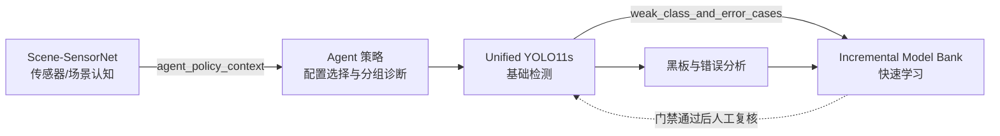

# 三个功能模型与协同证据

灵动Agent 使用三个不同功能模型形成 `环境认知 -> 目标检测 -> 快速学习` 闭环。唯一机器可读来源为 `configs/functional_models.yaml`，`doctor`、黑板、UI 和发布验收都读取该注册表。

## 模型职责

| 模型 | 独立功能 | 输入 | 输出 | 当前证据 |
|---|---|---|---|---|
| Scene-SensorNet | 场景与传感器认知 | RGB 图像 | IR/SAR、air/forest/sea/urban、置信度 | lock sensor 0.98947、scene 0.76842、joint 0.76842 |
| Unified YOLO11s | IR/SAR 四类目标检测 | RGB 图像 | 框、类别、置信度 | lock-all mAP50 0.91202 |
| Incremental Model Bank | 仅使用增量数据的模式感知增量目标检测 | 增量图像/标签、冻结基础权重、增量模式 | 组合预测、路由轨迹、New-mAP50、KRR | 增量检测器已进入 production，当前验证绑定为舰船 |

Scene-SensorNet 为 192,350 参数的双头 CNN，训练配置位于 `configs/scene_sensor_model.yaml`。模型选择只使用 dev，最终验收使用独立 lock；权重和指标分别位于 `models/context/scene_sensor_net.pt` 与 `models/context/scene_sensor_metrics.json`。

## 协同链路



Scene-SensorNet 不改变 YOLO 的输入张量；其概率仅作为软路由排序依据，不执行场景硬拒绝。目标增量模型需要基础同类目标和空间一致性证据；类别增量模型使用冻结基础类别集合外的 ID，并通过独立校准阈值激活。两种模式的训练和验证都只能读取增量数据。当前舰船 3+1 协议使用不含舰船输出通道的三类基础模型，舰船 specialist 不依赖基础同类框。

认知结果可直接进入策略：

```bash
python -m fair_agent.cli context-predict --source data/images/example.png
python -m fair_agent.cli decide --source data/images/example.png --class-focus soldier
python -m fair_agent.cli detect --source data/images/example.png --confidence 0.50
```

## 验收边界

三种功能均已通过 x86 NVIDIA GPU 加载和推理验收。增量检测器当前绑定的舰船类别使用增量 dev 固定的 0.63 阈值，在 TensorRT lock-val 复核中取得 New-mAP50 0.795、KRR 1.0、precision 1.0、误激活率 0.0，已进入默认 Web production。后续类别按独立绑定继续登记，不改变功能模型名称。三个模型均未完成 Ascend 310B 转换，因此注册表明确保留 `ascend_310b: false`，不得把 x86 smoke test 当作板端证据。
