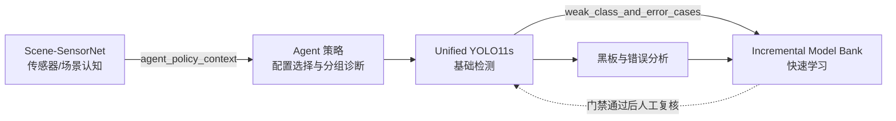

# 三个功能模型与协同证据

AgileAgent 使用三个不同功能模型形成 `环境认知 -> 目标检测 -> 快速学习` 闭环。唯一机器可读来源为 `configs/functional_models.yaml`，`doctor`、黑板、UI 和发布验收都读取该注册表。

## 模型职责

| 模型 | 独立功能 | 输入 | 输出 | 当前证据 |
|---|---|---|---|---|
| Scene-SensorNet | 场景与传感器认知 | RGB 图像 | IR/SAR、air/forest/sea/urban、置信度 | lock sensor 0.98947、scene 0.76842、joint 0.76842 |
| Unified YOLO11s | IR/SAR 四类目标检测 | RGB 图像 | 框、类别、置信度 | lock-all mAP50 0.91202 |
| Incremental Model Bank | 仅使用增量数据的增量目标检测，以类别增量为主并支持目标增量 | 增量图像/标签、冻结基础权重、增量模式 | 组合预测、New-mAP50、KRR、门禁结论 | 类别增量 p02-p04 通过，p01 待改进 |

Scene-SensorNet 为 192,350 参数的双头 CNN，训练配置位于 `configs/scene_sensor_model.yaml`。模型选择只使用 dev，最终验收使用独立 lock；权重和指标分别位于 `models/context/scene_sensor_net.pt` 与 `models/context/scene_sensor_metrics.json`。

## 协同链路



Scene-SensorNet 不改变 YOLO 的输入张量；其预测进入 Agent 策略上下文。增量模型当前以类别增量协议为主，同时允许目标增量协议；两种模式的训练和验证都只能读取增量数据。只有通过数据边界、New-mAP50 与 KRR 三重门禁的能力才进入 Web Agent 的自动候选评估。

认知结果可直接进入策略：

```bash
python -m fair_agent.cli context-predict --source data/images/example.png
python -m fair_agent.cli decide --source data/images/example.png --class-focus soldier
```

## 验收边界

三种功能均已通过 x86 NVIDIA GPU 加载和推理验收。Incremental Model Bank 标记为 `partially_verified`，因为 p01 New-mAP50 尚未达到 0.60。三个模型均未完成 Ascend 310B 转换，因此注册表明确保留 `ascend_310b: false`，不得把 x86 smoke test 当作板端证据。
